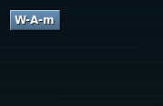

<h1 class="firstHeading">Help:Bindings</h1>

<h3 id="siteSub">From Openbox</h3>

Jump to: <a href="#column-one">navigation</a>, <a href="#searchInput">search</a>

Key and mouse bindings are created in your <code>~/.config/openbox/rc.xml</code> file.  You should copy the file from <code>/etc/xdg/openbox/rc.xml</code> to <code>~/.config/openbox/rc.xml</code> to edit it, if that file does not already exist.

Key bindings and mouse bindings both use <a href="Actions" title="Help:Actions"> Actions</a> to specify what they will do.  There are a <i>lot</i> of actions available to you.  Here we'll talk about how to write a generic key binding, or mouse binding.  See the <a href="Actions" title="Help:Actions"> actions documentation</a> for details about what actions are available to use and their varied options.

<table id="toc" class="toc"><tr><td>
<h2>Contents</h2>

<ul>
<li class="toclevel-1 tocsection-1"><a href="#Key_bindings">1 Key bindings</a>
<ul>
<li class="toclevel-2 tocsection-2"><a href="#Syntax">1.1 Syntax</a>
<ul>
<li class="toclevel-3 tocsection-3"><a href="#Key_combination">1.1.1 Key combination</a>
<ul>
<li class="toclevel-4 tocsection-4"><a href="#Modifiers">1.1.1.1 Modifiers</a></li>
<li class="toclevel-4 tocsection-5"><a href="#Keys">1.1.1.2 Keys</a></li>
</ul>
</li>
<li class="toclevel-3 tocsection-6"><a href="#Actions">1.1.2 Actions</a></li>
</ul>
</li>
<li class="toclevel-2 tocsection-7"><a href="#Key_chains">1.2 Key chains</a>
<ul>
<li class="toclevel-3 tocsection-8"><a href="#The_key_chain_dialog">1.2.1 The key chain dialog</a></li>
<li class="toclevel-3 tocsection-9"><a href="#Cancelling_key_chains">1.2.2 Cancelling key chains</a></li>
<li class="toclevel-3 tocsection-10"><a href="#Chrooting_key_chains">1.2.3 Chrooting key chains</a></li>
<li class="toclevel-3 tocsection-11"><a href="#Key_quoting_with_Chroots">1.2.4 Key quoting with Chroots</a></li>
</ul>
</li>
<li class="toclevel-2 tocsection-12"><a href="#Creating_hotkeys_from_the_command_line">1.3 Creating hotkeys from the command line</a></li>
</ul>
</li>
<li class="toclevel-1 tocsection-13"><a href="#Mouse_bindings">2 Mouse bindings</a>
<ul>
<li class="toclevel-2 tocsection-14"><a href="#Syntax_2">2.1 Syntax</a>
<ul>
<li class="toclevel-3 tocsection-15"><a href="#Context">2.1.1 Context</a></li>
<li class="toclevel-3 tocsection-16"><a href="#Button">2.1.2 Button</a></li>
<li class="toclevel-3 tocsection-17"><a href="#Event">2.1.3 Event</a></li>
<li class="toclevel-3 tocsection-18"><a href="#Actions_2">2.1.4 Actions</a></li>
</ul>
</li>
</ul>
</li>
</ul>
</td></tr></table>
<h1>  Key bindings </h1>

Key bindings are found in the &lt;keyboard&gt; section of your <code>rc.xml</code> configuration file.  Any bindings outside of that section are not valid and will be ignored.

Here are a few example key bindings from the default configuration file, to give us an idea of what we'll be talking about:

<code><pre>
&lt;keyboard&gt;
  &lt;keybind key=&quot;A-F4&quot;&gt;
    &lt;action name=&quot;Close&quot;/&gt;
  &lt;/keybind&gt;
  &lt;keybind key=&quot;A-Escape&quot;&gt;
    &lt;action name=&quot;Lower&quot;/&gt;
    &lt;action name=&quot;FocusToBottom&quot;/&gt;
    &lt;action name=&quot;Unfocus&quot;/&gt;
  &lt;/keybind&gt;
  &lt;keybind key=&quot;A-space&quot;&gt;
    &lt;action name=&quot;ShowMenu&quot;&gt;&lt;menu&gt;client-menu&lt;/menu&gt;&lt;/action&gt;
  &lt;/keybind&gt;
&lt;/keyboard&gt;
</pre></code>
<h2>  Syntax </h2>

A key binding is specified as follows:

<code><pre>
&lt;keyboard&gt;
  ...
  &lt;keybind key=&quot;KEY-COMBINATION...&quot;&gt;
    ...ACTIONS...
  &lt;/keybind&gt;
  ...
&lt;/keyboard&gt;
</pre></code>
<h3>  Key combination </h3>

<b>KEY-COMBINATION</b> is the key combination which you want to bind to the actions.  The format for the <b>KEY-COMBINATION</b> is: <code>Modifier-Modifier-Key</code>. Any number of modifiers (0 or more) can be used together, and they are each separated by a "-". Multiple <b>KEY-COMBINATION</b> can be specified in one keybind by separating them with spaces. This is useful if you use multiple keybinds for a thing that is quite complicated to specify.

<h4>  Modifiers </h4>
<table style="text-align:left">
<tr>
<th> Modifier keys
</th>
<td>
</td></tr>
<tr>
<th> S
</th>
<td> Shift key
</td></tr>
<tr>
<th> C
</th>
<td> Control key
</td></tr>
<tr>
<th> A
</th>
<td> Alt key
</td></tr>
<tr>
<th> W
</th>
<td> Super key (Usually bound to the Windows key on keyboards which have one)
</td></tr>
<tr>
<th> M
</th>
<td> Meta key
</td></tr>
<tr>
<th> H
</th>
<td> Hyper key (If it is bound to something)
</td></tr></table>

You can also use <tt>Mod1</tt> through <tt>Mod5</tt> as the modifiers to directly select a modifier mask (e.g. <tt>Mod1</tt> to select <tt>Mod1Mask</tt>), but this is for advanced users who have customized their modifier mapping with <code>xmodmap</code>.

<h4>  Keys </h4>

The <b>Key</b> is the name of the key, such as "a", "space", "Escape", "less", or "F1".  You can find the name of any key by using the <code>xev</code> command in a terminal, pressing the desired key, and watching the output from <code>xev</code> in the terminal. For example, the following <code>xev</code> output indicates, on the third line, that the <b>Menu</b> key was pressed.

<code><pre>
KeyRelease event, serial 36, synthetic NO, window 0x1e00001,
    root 0x7e, subw 0x0, time 29920856, (168,-7), root:(900,313),
    state 0x0, keycode 135 (keysym 0xff67, Menu), same_screen YES,
    XLookupString gives 0 bytes: 
    XFilterEvent returns: False
</pre></code>

This key can then be used as in the following example.

<code><pre>
&lt;keyboard&gt;
  ...
  &lt;keybind key=&quot;C-Menu S-F10&quot;&gt;
    &lt;action name=&quot;ShowMenu&quot;&gt;
      &lt;menu&gt;root-menu&lt;/menu&gt;
    &lt;/action&gt;
  &lt;/keybind&gt;
  ...
&lt;/keyboard&gt;
</pre></code>

Keys can also be specified by their numeric codes. This can be done by specifying the keycode in hex. To take the above example, the keycode for the <b>Menu</b> key is <b>135</b>, which is <b>0x87</b> in hexadecimal. This can then be used:

<code><pre>
&lt;keyboard&gt;
  ...
  &lt;keybind key=&quot;C-0x87&quot;&gt;
    &lt;action name=&quot;ShowMenu&quot;&gt;
      &lt;menu&gt;root-menu&lt;/menu&gt;
    &lt;/action&gt;
  &lt;/keybind&gt;
  ...
&lt;/keyboard&gt;
</pre></code>

Note that the "0x" prefix is required to interpret the key as a numeric keycode, and that the hex characters are case-insensitive (i.e. you can use "0xAE" or "0xae").

<h3>  Actions </h3>

The <b>ACTIONS</b> can be any number of <a href="Actions" title="Help:Actions"> actions</a>.  They will generally be executed in order from the first to the last.

<h2>  Key chains </h2>

You can create Emacs-style key chains simply by nesting key bindings inside each other.  Here's an example:

<code><pre>
  &lt;keybind key=&quot;C-f&quot;&gt;
    &lt;keybind key=&quot;x&quot;&gt;
      &lt;action name=&quot;ToggleMaximizeFull&quot;/&gt;
    &lt;/keybind&gt;
    &lt;keybind key=&quot;s&quot;&gt;
      &lt;action name=&quot;ToggleShade&quot;/&gt;
    &lt;/keybind&gt;
  &lt;/keybind&gt;
</pre></code>

In order to maximize a window using this key binding you would press the Control key and the "f" key together (which is written as C-f), then you would release everything and press the "x" key.

To shade a window, you would press Control and the "f" key together, and then release everything and press the "s" key.

You can create key chains within key chains, with as many levels as you want, if you wish to.

<h3>  The key chain dialog </h3>

  
The key chain dialog

When you start a key chain, after a short delay, a small dialog will appear in the top left corner of the screen to show you where you are in the key chain.

As long as you are in a key chain, other key bindings will not work except the ones found inside the key chain.

<h3>  Cancelling key chains </h3>

If you leave Openbox in a key chain state for too long without completing it, Openbox will cancel the key chain and restore your normal key bindings.

You can also use the "C-g" (Control key and "g" key together), in the default configuration, to cancel any key chain which you are in.  The choice of this key is controlled by the &lt;chainQuitKey&gt; in the &lt;keyboard&gt; section of the <code>rc.xml</code> configuration file.

The default &lt;chainQuitKey&gt; is defined as this:

<code><pre>
&lt;keyboard&gt;
  &lt;chainQuitKey&gt;C-g&lt;/chainQuitKey&gt;
  ...
&lt;/keyboard&gt;
</pre></code>
<h3>  Chrooting key chains </h3>

By default, once you get to the terminal end of a key chain, and run some actions with it, Openbox will exit the key chain and return to the normal key bindings.  With a "chrooted" key chain, Openbox will not leave the key chain automatically, and when you use keys further along the chain, it will stay within the chroot.

There are a number of examples of how this could be used, so you can get a better idea. You could use this to use the arrow keys to change desktops, for instance. A key chain setup such as:

<code><pre>
  &lt;keybind key=&quot;C-A-d&quot; chroot=&quot;true&quot;&gt;                                           
    &lt;keybind key=&quot;Up&quot;&gt;&lt;action name=&quot;DesktopUp&quot;&gt;&lt;dialog&gt;no&lt;/dialog&gt;&lt;/action&gt;&lt;/keybind&gt;                 
    &lt;keybind key=&quot;Down&quot;&gt;&lt;action name=&quot;DesktopDown&quot;&gt;&lt;dialog&gt;no&lt;/dialog&gt;&lt;/action&gt;&lt;/keybind&gt;                 
    &lt;keybind key=&quot;Left&quot;&gt;&lt;action name=&quot;DesktopLeft&quot;&gt;&lt;dialog&gt;no&lt;/dialog&gt;&lt;/action&gt;&lt;/keybind&gt;                 
    &lt;keybind key=&quot;Right&quot;&gt;&lt;action name=&quot;DesktopRight&quot;&gt;&lt;dialog&gt;no&lt;/dialog&gt;&lt;/action&gt;&lt;/keybind&gt;                 
    &lt;keybind key=&quot;Escape&quot;&gt;&lt;action name=&quot;BreakChroot&quot;/&gt;&lt;/keybind&gt;              
  &lt;/keybind&gt;
</pre></code>

This key chain would mean that when you pressed and released Control-Alt-D, you would enter a chroot. From then on, other key bindings would not function, but the Arrow keys by themselves would move your around your desktops. Pressing Escape or Control-G (in the default configuration) would take you back out of the chroot and return your key bindings to normal.

Once you enter a chrooted key chain, Openbox will not time out and leave the chain.  You will remain inside the key chain until you use a <i>BreakChroot</i> action, as shown here, or press the <a href="#Cancelling_key_chains"> &lt;chainQuitKey&gt;</a>.  BreakChroot actions are different from the &lt;chainQuitKey&gt; in that they will only break out of <i>one</i> chroot. So, if you have nested chroots, you can break out of only as many as you want, by placing 1 or more BreakChroot actions in a key binding.

<h3>  Key quoting with Chroots </h3>

Another use for chroots is "key quoting". This is used when you run an Openbox session in a window, such as a VNC client. In order to use key bindings inside the VNC, generally, you have to make sure that they are different from the ones in your main Openbox session.

With key quoting, you can use the same key bindings in both. Here's an example:

<code><pre>
  &lt;keybind key=&quot;C-A-q&quot; chroot=&quot;true&quot;&gt;
    &lt;keybind key=&quot;C-A-q&quot;&gt;&lt;action name=&quot;BreakChroot&quot;/&gt;&lt;/keybind&gt;
  &lt;/keybind&gt;
</pre></code>

With this example, when you pressed Control-Alt-Q, Openbox would enter the chroot. Then your normal Openbox key bindings would stop working and would instead be passed through to the VNC session (assuming you have it focused). When you were done, you could press Control-Alt-Q again, and your normal key bindings would be restored in you main Openbox session.

<h2>  Creating hotkeys from the command line </h2>

<a rel="nofollow" class="external text" href="http://obhotkey.sourceforge.net/">OBHotkey</a> lets you add/remove key bindings from the command line.

<h1>  Mouse bindings </h1>

Mouse bindings are used to bind <a href="Actions" title="Help:Actions">Actions</a> to mouse events.  These are used to control and define most of Openbox's interactive behavior, from what happens when you drag a window's titlebar, to when you press a window's Close button.

Mouse bindings are found in the &lt;mouse&gt; section of your <code>rc.xml</code> configuration file. Any bindings outside of that section are not valid and will be ignored.

 It is highly recommended that you build any custom mouse bindings from those in the default configuration, or the <a href="MouseFocusExample">mouse-focus example</a>, rather than starting from nothing, as they are rather intricate and have some advanced but subtle features.

To get us started, here are a few example mouse bindings from the default configuration file:

<code><pre>
&lt;mouse&gt;
  &lt;context name=&quot;Titlebar&quot;&gt;
    &lt;mousebind button=&quot;Left&quot; action=&quot;Press&quot;&gt;
      &lt;action name=&quot;Focus&quot;/&gt;
      &lt;action name=&quot;Raise&quot;/&gt;
    &lt;/mousebind&gt;
    &lt;mousebind button=&quot;Left&quot; action=&quot;Click&quot;&gt;
      &lt;action name=&quot;Unshade&quot;/&gt;
    &lt;/mousebind&gt;
    &lt;mousebind button=&quot;Left&quot; action=&quot;Drag&quot;&gt;
      &lt;action name=&quot;Move&quot;/&gt;
    &lt;/mousebind&gt;
    &lt;mousebind button=&quot;Left&quot; action=&quot;DoubleClick&quot;&gt;
      &lt;action name=&quot;ToggleMaximizeFull&quot;/&gt;
    &lt;/mousebind&gt;

    &lt;mousebind button=&quot;Up&quot; action=&quot;Click&quot;&gt;
      &lt;action name=&quot;Shade&quot;/&gt;
      &lt;action name=&quot;FocusToBottom&quot;/&gt;
      &lt;action name=&quot;Unfocus&quot;/&gt;
    &lt;/mousebind&gt;
    &lt;mousebind button=&quot;Down&quot; action=&quot;Click&quot;&gt;
      &lt;action name=&quot;Unshade&quot;/&gt;
    &lt;/mousebind&gt;
  &lt;/context&gt;
&lt;/mouse&gt;
</pre></code>
<h2>  Syntax </h2>

A mouse binding is specified as follows:

<code><pre>
&lt;mouse&gt;
  ...
  &lt;context name=&quot;CONTEXT...&quot;&gt;
    &lt;mousebind button=&quot;BUTTON...&quot; action=&quot;EVENT&quot;&gt;
      ...ACTIONS...
    &lt;/mousebind&gt;
  &lt;/context&gt;
  ...
&lt;/mouse&gt;
</pre></code>

Any number of &lt;mousebind&gt;s may appear within a &lt;context&gt;, and any number of <a href="Actions" title="Help:Actions"> Actions</a> may appear within a &lt;mousebind&gt;.

<h3>  Context </h3>

Mouse bindings, unlike key bindings, are made within <b>contexts</b>.  The <b>CONTEXT</b> represents what you are clicking/dragging on with your mouse (with the exception of the special MoveResize context). You can create identical mousebinds for multiple contexts at once by specifying the contexts separated by spaces in the name attribute.

<ul><li> <b>Frame</b>
<ul><li> The entire window frame for any window (except the desktop).  This includes both the window decorations (if any) and the application window itself.
<ul><li> <b>Note:</b> When a button is bound in this context, the clicks will <i>not</i> be passed through to the application. Use with care.
</li></ul>
</li></ul>
</li></ul>
<ul><li> <b>Client</b>
<ul><li> The application window, inside the window decorations.
<ul><li> <b>Note</b>: When a button is bound in this context, the clicks <i>will</i> be passed through to the application. However, because of this, only "Press" events can be used for this context.
</li></ul>
</li></ul>
</li></ul>
<ul><li> <b>Desktop</b>
<ul><li> The desktop, or background, regardless of if you use a program to place icons on your desktop or not (such as in KDE and GNOME).  This is also called the "root window" frequently.
</li></ul>
</li></ul>
<ul><li> <b>Root</b>
<ul><li> This works similarly to the Desktop context.  However, this is a special context for bindings you only want to work only when you <i>don't</i> have a program running to place icons on your desktop.  Generally this is only used for the root menus, so that they won't override the menus provided by your desktop icons.
</li></ul>
</li></ul>
<ul><li> <b>Titlebar</b>
<ul><li> The decorations on the top of each application window
</li></ul>
</li></ul>
<ul><li> <b>Top</b>, <b>Bottom</b>, <b>Left</b>, <b>Right</b>
<ul><li> The top, bottom, left or right edge of a window
</li></ul>
</li></ul>
<ul><li> <b>TLCorner</b>, <b>TRCorner</b>, <b>BLCorner</b>, <b>BRCorner</b>
<ul><li> The top-left, top-right, bottom-left or bottom-right corner of a window
</li></ul>
</li></ul>
<ul><li> <b>Icon</b>
<ul><li> The window icon shown in window titlebars
</li></ul>
</li></ul>
<ul><li> <b>Iconify</b>
<ul><li> The iconify button shown in window titlebars
</li></ul>
</li></ul>
<ul><li> <b>Maximize</b>
<ul><li> The maximize button shown in window titlebars
</li></ul>
</li></ul>
<ul><li> <b>Close</b>
<ul><li> The close button shown in window titlebars
</li></ul>
</li></ul>
<ul><li> <b>AllDesktops</b>
<ul><li> The all-desktops (omnipresent) button shown in window titlebars
</li></ul>
</li></ul>
<ul><li> <b>Shade</b>
<ul><li> The shade button shown in window titlebars
</li></ul>
</li></ul>
<ul><li> <b>MoveResize</b>
<ul><li> Bindings in this special context are available while a window is being moved or resized interactively
</li></ul>
</li></ul>
<h3>  Button </h3>

The <b>BUTTON</b> specifies which mouse button is used to trigger the mouse binding.

The named buttons are: <code>Left</code>, <code>Right</code>, <code>Middle</code>, <code>Up</code> (scroll wheel up) and <code>Down</code> (scroll wheel down).  To bind more than 5 buttons, use <code>Button6</code>, <code>Button7</code> and so on.

You can also prefix the button name with a modifier as for key bindings (see above section), for example <code>S-A-Down</code> for shift-alt-scroll wheel down.

You can create multiple mousebinds that trigger the same set of actions by specifying them separated by spaces.

<h3>  Event </h3>

The <b>EVENT</b> for a mouse binding specifies what mouse event triggers the actions contained within.

<ul><li> <b>Press</b>
<ul><li> The mouse button was pressed down in the specified context
</li></ul>
</li><li> <b>Click</b>
<ul><li> The mouse button was pressed and released in the specified context
</li></ul>
</li><li> <b>DoubleClick</b>
<ul><li> The mouse button was double clicked in the specified context
</li></ul>
</li><li> <b>Release</b>
<ul><li> The mouse button was released in the specified context
</li></ul>
</li><li> <b>Drag</b>
<ul><li> The mouse was dragged with the mouse button held down in the specified context
</li></ul>
</li></ul>
<h3>  Actions </h3>

The <b>ACTIONS</b> can be any number of <a href="Actions" title="Help:Actions"> actions</a>.  They will generally be executed in order from the first to the last.

