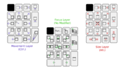
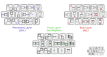

<h1 class="firstHeading">Help:ClaysViStyleSpatial</h1>

<h3 id="siteSub">From Openbox</h3>

Jump to: <a href="#column-one">navigation</a>, <a href="#searchInput">search</a>

<table id="toc" class="toc"><tr><td>
<h2>Contents</h2>

<ul>
<li class="toclevel-1 tocsection-1"><a href="#Clay_Barnes.27_Vim-Style_Openbox_bindings">1 Clay Barnes' Vim-Style Openbox bindings</a></li>
<li class="toclevel-1 tocsection-2"><a href="#Alternate_Vim-style_ctrl-w_Bindings">2 Alternate Vim-style ctrl-w Bindings</a></li>
</ul>
</td></tr></table>

 

<h2>  Clay Barnes' Vim-Style Openbox bindings </h2>

  

Number-Pad Reference (WUXGA)

  

Number-Pad Reference (WVGA)

  

Main Keyboard Reference (WUXGA)

  

Main Keyboard Reference (WVGA)

(Taken from <a rel="nofollow" class="external text" href="http://hci-matters.com/blog/?p=7">Clay Barnes' blog entry</a>)

These bindings were originally designed to prove that all window managments 
functions could be effectivly replaced by modifier keys and the number pad.
Eventually they were ported to a vaguely vi-styled main keyboard design.

Note that the images do not document the direct-to workspace bindings or several redundant/transitional extra bindings:

<ol><li> W-F[n] goes to workspace [n]
</li><li> W-C-F[n] goes to workspace [n] bringing the currently selected application along
</li><li> W-C-F[n] sends the currently selected application to workspace [n]
</li><li> W-tab/W-S-tab emulate traditional alt-tab designs
</li><li> W-backslash/W-S-backslash switch to the next/previous workspaces
</li><li> W-T opens a terminal
</li><li> and several others (see the xml)
</li></ol>
<code><pre>
&lt;?xml version=&quot;1.0&quot; encoding=&quot;UTF-8&quot;?&gt;
&lt;openbox_config xmlns=&quot;http://openbox.org/&quot;
xmlns:xsi=&quot;http://www.w3.org/2001/XMLSchema-instance&quot;
xsi:schemaLocation=&quot;http://openbox.org/                 file:///home/clay/openbox/rc.xsd&quot;&gt;
&lt;!--  Clay's keybindings: &quot;Collision-Free Commanding&quot;
A prototype interaction paradigm based off of muscle-memory and vi-style 
bindings, and designed to avoid any key binding collisions with programs, 
all interactions (that could possibly be sent to an application) include 
the Super/Meta4 key (often labled the &quot;Windows Key&quot;).
--&gt;
&lt;applications&gt;
  &lt;!-- match all windows, and remove their decorations --&gt;
  &lt;application class=&quot;*&quot;&gt;
    &lt;decor&gt;no&lt;/decor&gt;
  &lt;/application&gt;
&lt;/applications&gt;

&lt;resistance&gt;
  &lt;strength&gt;25&lt;/strength&gt;
  &lt;screen_edge_strength&gt;50&lt;/screen_edge_strength&gt; 
&lt;/resistance&gt;

&lt;focus&gt;
  &lt;focusNew&gt;yes&lt;/focusNew&gt;
  &lt;followMouse&gt;yes&lt;/followMouse&gt;
  &lt;focusLast&gt;yes&lt;/focusLast&gt;
  &lt;focusDelay&gt;0&lt;/focusDelay&gt;
  &lt;raiseOnFocus&gt;no&lt;/raiseOnFocus&gt;
&lt;/focus&gt;

&lt;theme&gt;
  &lt;name&gt;Nop&lt;/name&gt;
  &lt;titlelayout&gt;NLIMC&lt;/titlelayout&gt;
  &lt;animateIconify&gt;no&lt;/animateIconify&gt;
&lt;/theme&gt;

&lt;placement&gt;
  &lt;policy&gt;Smart&lt;/policy&gt;
&lt;/placement&gt;

&lt;desktops&gt;
  &lt;number&gt;12&lt;/number&gt;
  &lt;firstdesk&gt;1&lt;/firstdesk&gt;
  &lt;names&gt;
    &lt;name&gt;Alpha (1)&lt;/name&gt;
    &lt;name&gt;Beta (2)&lt;/name&gt;
    &lt;name&gt;Gamma (3)&lt;/name&gt;
    &lt;name&gt;Delta (4)&lt;/name&gt;
    &lt;name&gt;Epsilon (5)&lt;/name&gt;
    &lt;name&gt;Zeta (6)&lt;/name&gt;
    &lt;name&gt;Eta (7)&lt;/name&gt;
    &lt;name&gt;Theta (8)&lt;/name&gt;
    &lt;name&gt;Iota (9)&lt;/name&gt;
    &lt;name&gt;Kappa (10)&lt;/name&gt;
    &lt;name&gt;Lambda (11)&lt;/name&gt;
    &lt;name&gt;Mu (12)&lt;/name&gt;
  &lt;/names&gt;
&lt;/desktops&gt;

&lt;resize&gt;
  &lt;drawContents&gt;yes&lt;/drawContents&gt;
&lt;/resize&gt;

&lt;dock&gt;
  &lt;position&gt;TopLeft&lt;/position&gt;
  &lt;stacking&gt;Top&lt;/stacking&gt;
  &lt;direction&gt;Vertical&lt;/direction&gt;
  &lt;floatingX&gt;0&lt;/floatingX&gt;
  &lt;floatingY&gt;0&lt;/floatingY&gt;
  &lt;autoHide&gt;yes&lt;/autoHide&gt;
  &lt;hideDelay&gt;500&lt;/hideDelay&gt;
  &lt;moveButton&gt;W-Left&lt;/moveButton&gt;
&lt;/dock&gt;

&lt;keyboard&gt;
  &lt;chainQuitKey&gt;W-q&lt;/chainQuitKey&gt;

&lt;!--XXXXXXXXXXXXXXXXXXXXXXXXXXXXXXXXXXXXXXXXXXXXXXXXXXXXXXXXXXXXXXXXXXXXXXXXX--&gt;
&lt;!--XXXX              (Almost) One-handed Control Prototype              XXXX--&gt;
&lt;!--XXXXXXXXXXXXXXXXXXXXXXXXXXXXXXXXXXXXXXXXXXXXXXXXXXXXXXXXXXXXXXXXXXXXXXXXX--&gt;
&lt;!--Movement Layer--&gt;
  &lt;keybind key=&quot;W-C-KP_7&quot;&gt;		&lt;action name=&quot;MoveToEdgeNorthWest&quot;/&gt;	&lt;/keybind&gt;
  &lt;keybind key=&quot;W-C-KP_9&quot;&gt;		&lt;action name=&quot;MoveToEdgeNorthEast&quot;/&gt;	&lt;/keybind&gt;
  &lt;keybind key=&quot;W-C-KP_1&quot;&gt;		&lt;action name=&quot;MoveToEdgeSouthWest&quot;/&gt;	&lt;/keybind&gt;
  &lt;keybind key=&quot;W-C-KP_3&quot;&gt;		&lt;action name=&quot;MoveToEdgeSouthEast&quot;/&gt;	&lt;/keybind&gt;
  &lt;keybind key=&quot;W-C-U&quot;&gt; 		&lt;action name=&quot;MoveToEdgeNorthWest&quot;/&gt;	&lt;/keybind&gt;
  &lt;keybind key=&quot;W-C-I&quot;&gt; 		&lt;action name=&quot;MoveToEdgeNorthEast&quot;/&gt;	&lt;/keybind&gt;
  &lt;keybind key=&quot;W-C-N&quot;&gt; 		&lt;action name=&quot;MoveToEdgeSouthWest&quot;/&gt;	&lt;/keybind&gt;
  &lt;keybind key=&quot;W-C-M&quot;&gt; 		&lt;action name=&quot;MoveToEdgeSouthEast&quot;/&gt;	&lt;/keybind&gt;

  &lt;keybind key=&quot;W-C-KP_8&quot;&gt;		&lt;action name=&quot;MoveToEdgeNorth&quot;/&gt;	&lt;/keybind&gt;
  &lt;keybind key=&quot;W-C-K&quot;&gt;			&lt;action name=&quot;MoveToEdgeNorth&quot;/&gt;	&lt;/keybind&gt;
  &lt;keybind key=&quot;W-C-KP_4&quot;&gt;		&lt;action name=&quot;MoveToEdgeWest&quot;/&gt;		&lt;/keybind&gt;
  &lt;keybind key=&quot;W-C-H&quot;&gt;			&lt;action name=&quot;MoveToEdgeWest&quot;/&gt;		&lt;/keybind&gt;
  &lt;keybind key=&quot;W-C-KP_5&quot;&gt;		&lt;action name=&quot;MoveToCenter&quot;/&gt;		&lt;/keybind&gt;
  &lt;keybind key=&quot;W-C-semicolon&quot;&gt;		&lt;action name=&quot;MoveToCenter&quot;/&gt;		&lt;/keybind&gt;
  &lt;keybind key=&quot;W-C-KP_6&quot;&gt;		&lt;action name=&quot;MoveToEdgeEast&quot;/&gt;		&lt;/keybind&gt;
  &lt;keybind key=&quot;W-C-L&quot;&gt;			&lt;action name=&quot;MoveToEdgeEast&quot;/&gt;		&lt;/keybind&gt;
  &lt;keybind key=&quot;W-C-KP_2&quot;&gt;		&lt;action name=&quot;MoveToEdgeSouth&quot;/&gt;	&lt;/keybind&gt;
  &lt;keybind key=&quot;W-C-J&quot;&gt;			&lt;action name=&quot;MoveToEdgeSouth&quot;/&gt;	&lt;/keybind&gt;

  &lt;keybind key=&quot;W-C-KP_0&quot;&gt;		&lt;action name=&quot;SendToDesktopPrevious&quot;&gt;&lt;dialog&gt;no&lt;/dialog&gt;&lt;/action&gt;	&lt;/keybind&gt;
  &lt;keybind key=&quot;W-C-comma&quot;&gt;		&lt;action name=&quot;SendToDesktopPrevious&quot;&gt;&lt;dialog&gt;no&lt;/dialog&gt;&lt;/action&gt;	&lt;/keybind&gt;

  &lt;keybind key=&quot;W-C-KP_Decimal&quot;&gt;	&lt;action name=&quot;SendToDesktopNext&quot;&gt;&lt;dialog&gt;no&lt;/dialog&gt;&lt;/action&gt;	&lt;/keybind&gt;
  &lt;keybind key=&quot;W-C-period&quot;&gt;		&lt;action name=&quot;SendToDesktopNext&quot;&gt;&lt;dialog&gt;no&lt;/dialog&gt;&lt;/action&gt;	&lt;/keybind&gt;
  
  &lt;keybind key=&quot;W-C-KP_Divide&quot;&gt;		&lt;action name=&quot;MoveRelative&quot;&gt;&lt;x&gt;-20&lt;/x&gt;&lt;/action&gt;	&lt;/keybind&gt;
  &lt;keybind key=&quot;W-C-O&quot;&gt;			&lt;action name=&quot;MoveRelative&quot;&gt;&lt;x&gt;-20&lt;/x&gt;&lt;/action&gt;	&lt;/keybind&gt;
  &lt;keybind key=&quot;W-C-KP_Multiply&quot;&gt;	&lt;action name=&quot;MoveRelative&quot;&gt;&lt;x&gt;20&lt;/x&gt;&lt;/action&gt;	&lt;/keybind&gt;
  &lt;keybind key=&quot;W-C-P&quot;&gt;			&lt;action name=&quot;MoveRelative&quot;&gt;&lt;x&gt;20&lt;/x&gt;&lt;/action&gt;	&lt;/keybind&gt;
  &lt;keybind key=&quot;W-C-KP_Subtract&quot;&gt;	&lt;action name=&quot;MoveRelative&quot;&gt;&lt;y&gt;-20&lt;/y&gt;&lt;/action&gt;	&lt;/keybind&gt;
  &lt;keybind key=&quot;W-C-bracketleft&quot;&gt;	&lt;action name=&quot;MoveRelative&quot;&gt;&lt;y&gt;-20&lt;/y&gt;&lt;/action&gt;	&lt;/keybind&gt;
  &lt;keybind key=&quot;W-C-KP_Add&quot;&gt;		&lt;action name=&quot;MoveRelative&quot;&gt;&lt;y&gt;20&lt;/y&gt;&lt;/action&gt;	&lt;/keybind&gt;
  &lt;keybind key=&quot;W-C-apostrophe&quot;&gt;	&lt;action name=&quot;MoveRelative&quot;&gt;&lt;y&gt;20&lt;/y&gt;&lt;/action&gt;	&lt;/keybind&gt;
  
  &lt;keybind key=&quot;W-C-KP_Enter&quot;&gt;		&lt;action name=&quot;Iconify&quot;/&gt;		&lt;/keybind&gt;
  &lt;keybind key=&quot;W-C-slash&quot;&gt;		&lt;action name=&quot;Iconify&quot;/&gt;		&lt;/keybind&gt;
&lt;!--END of Movement Layer--&gt;

&lt;!--Focus Layer--&gt;
  &lt;keybind key=&quot;W-KP_7&quot;&gt;	&lt;action name=&quot;DirectionalFocusNorthWest&quot;/&gt;	&lt;/keybind&gt;
  &lt;keybind key=&quot;W-KP_9&quot;&gt;	&lt;action name=&quot;DirectionalFocusNorthEast&quot;/&gt;	&lt;/keybind&gt;
  &lt;keybind key=&quot;W-KP_1&quot;&gt;	&lt;action name=&quot;DirectionalFocusSouthWest&quot;/&gt;	&lt;/keybind&gt;
  &lt;keybind key=&quot;W-KP_3&quot;&gt;	&lt;action name=&quot;DirectionalFocusSouthEast&quot;/&gt;	&lt;/keybind&gt;
  &lt;keybind key=&quot;W-U&quot;&gt;   	&lt;action name=&quot;DirectionalFocusNorthWest&quot;/&gt;	&lt;/keybind&gt;
  &lt;keybind key=&quot;W-I&quot;&gt;   	&lt;action name=&quot;DirectionalFocusNorthEast&quot;/&gt;	&lt;/keybind&gt;
  &lt;keybind key=&quot;W-N&quot;&gt;   	&lt;action name=&quot;DirectionalFocusSouthWest&quot;/&gt;	&lt;/keybind&gt;
  &lt;keybind key=&quot;W-M&quot;&gt;   	&lt;action name=&quot;DirectionalFocusSouthEast&quot;/&gt;	&lt;/keybind&gt;
  &lt;keybind key=&quot;W-S-KP_5&quot;&gt;	&lt;action name=&quot;PreviousWindow&quot;/&gt;			&lt;/keybind&gt;

  &lt;keybind key=&quot;W-KP_8&quot;&gt;	&lt;action name=&quot;DirectionalFocusNorth&quot;/&gt;		&lt;/keybind&gt;
  &lt;keybind key=&quot;W-K&quot;&gt;		&lt;action name=&quot;DirectionalFocusNorth&quot;/&gt;		&lt;/keybind&gt;
  &lt;keybind key=&quot;W-KP_4&quot;&gt;	&lt;action name=&quot;DirectionalFocusWest&quot;/&gt;		&lt;/keybind&gt;
  &lt;keybind key=&quot;W-H&quot;&gt;		&lt;action name=&quot;DirectionalFocusWest&quot;/&gt;		&lt;/keybind&gt;
  &lt;keybind key=&quot;W-KP_5&quot;&gt;	&lt;action name=&quot;NextWindow&quot;/&gt;			&lt;/keybind&gt;
  &lt;keybind key=&quot;W-semicolon&quot;&gt;	&lt;action name=&quot;NextWindow&quot;/&gt;			&lt;/keybind&gt;
  &lt;keybind key=&quot;W-S-KP_5&quot;&gt;	&lt;action name=&quot;PreviousWindow&quot;/&gt;			&lt;/keybind&gt;
  &lt;keybind key=&quot;W-S-semicolon&quot;&gt;	&lt;action name=&quot;PreviousWindow&quot;/&gt;			&lt;/keybind&gt;
  &lt;keybind key=&quot;W-KP_6&quot;&gt;	&lt;action name=&quot;DirectionalFocusEast&quot;/&gt;		&lt;/keybind&gt;
  &lt;keybind key=&quot;W-L&quot;&gt;		&lt;action name=&quot;DirectionalFocusEast&quot;/&gt;		&lt;/keybind&gt;
  &lt;keybind key=&quot;W-KP_2&quot;&gt;	&lt;action name=&quot;DirectionalFocusSouth&quot;/&gt;		&lt;/keybind&gt;
  &lt;keybind key=&quot;W-J&quot;&gt;		&lt;action name=&quot;DirectionalFocusSouth&quot;/&gt;		&lt;/keybind&gt;
  
  &lt;keybind key=&quot;W-KP_0&quot;&gt;	&lt;action name=&quot;DesktopPrevious&quot;/&gt;		&lt;/keybind&gt;
  &lt;keybind key=&quot;W-comma&quot;&gt;	&lt;action name=&quot;DesktopPrevious&quot;/&gt;		&lt;/keybind&gt;
  &lt;keybind key=&quot;W-KP_Decimal&quot;&gt;	&lt;action name=&quot;DesktopNext&quot;/&gt;			&lt;/keybind&gt;
  &lt;keybind key=&quot;W-period&quot;&gt;	&lt;action name=&quot;DesktopNext&quot;/&gt;			&lt;/keybind&gt;
  
  &lt;keybind key=&quot;W-KP_Divide&quot;&gt;	&lt;action name=&quot;Execute&quot;&gt;&lt;command&gt;gmrun&lt;/command&gt;&lt;/action&gt;	&lt;/keybind&gt;
  &lt;keybind key=&quot;W-O&quot;&gt;		&lt;action name=&quot;Execute&quot;&gt;&lt;command&gt;gmrun&lt;/command&gt;&lt;/action&gt;	&lt;/keybind&gt;
  
  &lt;keybind key=&quot;W-KP_Multiply&quot;&gt;	&lt;action name=&quot;ToggleOmnipresent&quot;/&gt;		&lt;/keybind&gt;
  &lt;keybind key=&quot;W-P&quot;&gt;		&lt;action name=&quot;ToggleOmnipresent&quot;/&gt;		&lt;/keybind&gt;
  
  &lt;keybind key=&quot;W-KP_Subtract&quot;&gt;	&lt;action name=&quot;Raise&quot;/&gt;				&lt;/keybind&gt;
  &lt;keybind key=&quot;W-bracketleft&quot;&gt;	&lt;action name=&quot;Raise&quot;/&gt;				&lt;/keybind&gt;
  &lt;keybind key=&quot;W-KP_Add&quot;&gt;	&lt;action name=&quot;Lower&quot;/&gt;				&lt;/keybind&gt;
  &lt;keybind key=&quot;W-apostrophe&quot;&gt;	&lt;action name=&quot;Lower&quot;/&gt;				&lt;/keybind&gt;
  
  &lt;keybind key=&quot;W-KP_Enter&quot;&gt;	&lt;action name=&quot;ToggleDecorations&quot;/&gt;		&lt;/keybind&gt;
  &lt;keybind key=&quot;W-slash&quot;&gt;	&lt;action name=&quot;ToggleDecorations&quot;/&gt;		&lt;/keybind&gt;

&lt;!--END Focus Layer--&gt;

&lt;!--Size Layer--&gt;
  &lt;keybind key=&quot;W-A-KP_7&quot;&gt;	&lt;action name=&quot;GrowToEdgeNorthWest&quot;/&gt;		&lt;/keybind&gt;
  &lt;keybind key=&quot;W-A-KP_9&quot;&gt;	&lt;action name=&quot;GrowToEdgeNorthEast&quot;/&gt;		&lt;/keybind&gt;
  &lt;keybind key=&quot;W-A-KP_1&quot;&gt;	&lt;action name=&quot;GrowToEdgeSouthWest&quot;/&gt;		&lt;/keybind&gt;
  &lt;keybind key=&quot;W-A-KP_3&quot;&gt;	&lt;action name=&quot;GrowToEdgeSouthEast&quot;/&gt;		&lt;/keybind&gt;
  &lt;keybind key=&quot;W-A-U&quot;&gt; 	&lt;action name=&quot;GrowToEdgeNorthWest&quot;/&gt;		&lt;/keybind&gt;
  &lt;keybind key=&quot;W-A-I&quot;&gt; 	&lt;action name=&quot;GrowToEdgeNorthEast&quot;/&gt;		&lt;/keybind&gt;
  &lt;keybind key=&quot;W-A-N&quot;&gt; 	&lt;action name=&quot;GrowToEdgeSouthWest&quot;/&gt;		&lt;/keybind&gt;
  &lt;keybind key=&quot;W-A-M&quot;&gt; 	&lt;action name=&quot;GrowToEdgeSouthEast&quot;/&gt;		&lt;/keybind&gt;

  &lt;keybind key=&quot;W-A-KP_8&quot;&gt;	&lt;action name=&quot;GrowToEdgeNorth&quot;/&gt;		&lt;/keybind&gt;
  &lt;keybind key=&quot;W-A-K&quot;&gt;		&lt;action name=&quot;GrowToEdgeNorth&quot;/&gt;		&lt;/keybind&gt;
  &lt;keybind key=&quot;W-A-KP_4&quot;&gt;	&lt;action name=&quot;GrowToEdgeWest&quot;/&gt;			&lt;/keybind&gt;
  &lt;keybind key=&quot;W-A-H&quot;&gt;		&lt;action name=&quot;GrowToEdgeWest&quot;/&gt;			&lt;/keybind&gt;
  &lt;keybind key=&quot;W-A-KP_5&quot;&gt;	&lt;action name=&quot;Close&quot;/&gt;				&lt;/keybind&gt;
  &lt;keybind key=&quot;W-A-semicolon&quot;&gt;	&lt;action name=&quot;Close&quot;/&gt;				&lt;/keybind&gt;
  &lt;keybind key=&quot;W-A-KP_6&quot;&gt;	&lt;action name=&quot;GrowToEdgeEast&quot;/&gt;			&lt;/keybind&gt;
  &lt;keybind key=&quot;W-A-L&quot;&gt;		&lt;action name=&quot;GrowToEdgeEast&quot;/&gt;			&lt;/keybind&gt;
  &lt;keybind key=&quot;W-A-KP_2&quot;&gt;	&lt;action name=&quot;GrowToEdgeSouth&quot;/&gt;		&lt;/keybind&gt;
  &lt;keybind key=&quot;W-A-J&quot;&gt;		&lt;action name=&quot;GrowToEdgeSouth&quot;/&gt;		&lt;/keybind&gt;

  &lt;keybind key=&quot;W-A-KP_Divide&quot;&gt;		&lt;action name=&quot;ResizeRelative&quot;&gt;&lt;right&gt;-20&lt;/right&gt;&lt;/action&gt;	&lt;/keybind&gt;
  &lt;keybind key=&quot;W-A-O&quot;&gt;			&lt;action name=&quot;ResizeRelative&quot;&gt;&lt;right&gt;-20&lt;/right&gt;&lt;/action&gt;	&lt;/keybind&gt;
  &lt;keybind key=&quot;W-A-KP_Multiply&quot;&gt;	&lt;action name=&quot;ResizeRelative&quot;&gt;&lt;right&gt;20&lt;/right&gt;&lt;/action&gt;	&lt;/keybind&gt;
  &lt;keybind key=&quot;W-A-P&quot;&gt;			&lt;action name=&quot;ResizeRelative&quot;&gt;&lt;right&gt;20&lt;/right&gt;&lt;/action&gt;	&lt;/keybind&gt;
  &lt;keybind key=&quot;W-A-KP_Subtract&quot;&gt;	&lt;action name=&quot;ResizeRelative&quot;&gt;&lt;bottom&gt;-20&lt;/bottom&gt;&lt;/action&gt;	&lt;/keybind&gt;
  &lt;keybind key=&quot;W-A-bracketleft&quot;&gt;	&lt;action name=&quot;ResizeRelative&quot;&gt;&lt;bottom&gt;-20&lt;/bottom&gt;&lt;/action&gt;	&lt;/keybind&gt;
  &lt;keybind key=&quot;W-A-KP_Add&quot;&gt;		&lt;action name=&quot;ResizeRelative&quot;&gt;&lt;bottom&gt;20&lt;/bottom&gt;&lt;/action&gt;	&lt;/keybind&gt;
  &lt;keybind key=&quot;W-A-apostrophe&quot;&gt;	&lt;action name=&quot;ResizeRelative&quot;&gt;&lt;bottom&gt;20&lt;/bottom&gt;&lt;/action&gt;	&lt;/keybind&gt;
  
  &lt;keybind key=&quot;W-A-KP_0&quot;&gt;		&lt;action name=&quot;ToggleMaximizeHorz&quot;/&gt;	&lt;/keybind&gt;
  &lt;keybind key=&quot;W-A-comma&quot;&gt;		&lt;action name=&quot;ToggleMaximizeHorz&quot;/&gt;	&lt;/keybind&gt;
  &lt;keybind key=&quot;W-A-KP_Decimal&quot;&gt;	&lt;action name=&quot;ToggleShade&quot;/&gt;		&lt;/keybind&gt;
  &lt;keybind key=&quot;W-A-period&quot;&gt;		&lt;action name=&quot;ToggleShade&quot;/&gt;		&lt;/keybind&gt;
  &lt;keybind key=&quot;W-A-KP_Enter&quot;&gt;		&lt;action name=&quot;ToggleMaximizeVert&quot;/&gt;	&lt;/keybind&gt;
  &lt;keybind key=&quot;W-A-slash&quot;&gt;		&lt;action name=&quot;ToggleMaximizeVert&quot;/&gt;	&lt;/keybind&gt;

&lt;!--END of Size Layer--&gt;

&lt;!--XXXXXXXXXXXXXXXXXXXXXXXXXXXXXXXXXXXXXXXXXXXXXXXXXXXXXXXXXXXXXXXXXXXXXXXXX--&gt;

&lt;!--Workspace Switch Bindings--&gt;
  &lt;keybind key=&quot;W-C-F1&quot;&gt;	&lt;action name=&quot;SendToDesktop&quot;&gt;&lt;desktop&gt;1&lt;/desktop&gt;&lt;follow&gt;yes&lt;/follow&gt;&lt;/action&gt;	&lt;/keybind&gt;
  &lt;keybind key=&quot;W-C-F2&quot;&gt;	&lt;action name=&quot;SendToDesktop&quot;&gt;&lt;desktop&gt;2&lt;/desktop&gt;&lt;follow&gt;yes&lt;/follow&gt;&lt;/action&gt;	&lt;/keybind&gt;
  &lt;keybind key=&quot;W-C-F3&quot;&gt;	&lt;action name=&quot;SendToDesktop&quot;&gt;&lt;desktop&gt;3&lt;/desktop&gt;&lt;follow&gt;yes&lt;/follow&gt;&lt;/action&gt;	&lt;/keybind&gt;
  &lt;keybind key=&quot;W-C-F4&quot;&gt;	&lt;action name=&quot;SendToDesktop&quot;&gt;&lt;desktop&gt;4&lt;/desktop&gt;&lt;follow&gt;yes&lt;/follow&gt;&lt;/action&gt;	&lt;/keybind&gt;
  &lt;keybind key=&quot;W-C-F5&quot;&gt;	&lt;action name=&quot;SendToDesktop&quot;&gt;&lt;desktop&gt;5&lt;/desktop&gt;&lt;follow&gt;yes&lt;/follow&gt;&lt;/action&gt;	&lt;/keybind&gt;
  &lt;keybind key=&quot;W-C-F6&quot;&gt;	&lt;action name=&quot;SendToDesktop&quot;&gt;&lt;desktop&gt;6&lt;/desktop&gt;&lt;follow&gt;yes&lt;/follow&gt;&lt;/action&gt;	&lt;/keybind&gt;
  &lt;keybind key=&quot;W-C-F7&quot;&gt;	&lt;action name=&quot;SendToDesktop&quot;&gt;&lt;desktop&gt;7&lt;/desktop&gt;&lt;follow&gt;yes&lt;/follow&gt;&lt;/action&gt;	&lt;/keybind&gt;
  &lt;keybind key=&quot;W-C-F8&quot;&gt;	&lt;action name=&quot;SendToDesktop&quot;&gt;&lt;desktop&gt;8&lt;/desktop&gt;&lt;follow&gt;yes&lt;/follow&gt;&lt;/action&gt;	&lt;/keybind&gt;
  &lt;keybind key=&quot;W-C-F9&quot;&gt;	&lt;action name=&quot;SendToDesktop&quot;&gt;&lt;desktop&gt;9&lt;/desktop&gt;&lt;follow&gt;yes&lt;/follow&gt;&lt;/action&gt;	&lt;/keybind&gt;
  &lt;keybind key=&quot;W-C-F10&quot;&gt;	&lt;action name=&quot;SendToDesktop&quot;&gt;&lt;desktop&gt;10&lt;/desktop&gt;&lt;follow&gt;yes&lt;/follow&gt;&lt;/action&gt;	&lt;/keybind&gt;
  &lt;keybind key=&quot;W-C-F11&quot;&gt;	&lt;action name=&quot;SendToDesktop&quot;&gt;&lt;desktop&gt;11&lt;/desktop&gt;&lt;follow&gt;yes&lt;/follow&gt;&lt;/action&gt;	&lt;/keybind&gt;
  &lt;keybind key=&quot;W-C-F12&quot;&gt;	&lt;action name=&quot;SendToDesktop&quot;&gt;&lt;desktop&gt;12&lt;/desktop&gt;&lt;follow&gt;yes&lt;/follow&gt;&lt;/action&gt;	&lt;/keybind&gt;

  &lt;keybind key=&quot;W-F1&quot;&gt;	&lt;action name=&quot;Desktop&quot;&gt;&lt;desktop&gt;1&lt;/desktop&gt;&lt;dialog&gt;yes&lt;/dialog&gt;&lt;/action&gt;	&lt;/keybind&gt;
  &lt;keybind key=&quot;W-F2&quot;&gt;	&lt;action name=&quot;Desktop&quot;&gt;&lt;desktop&gt;2&lt;/desktop&gt;&lt;dialog&gt;yes&lt;/dialog&gt;&lt;/action&gt;	&lt;/keybind&gt;
  &lt;keybind key=&quot;W-F3&quot;&gt;	&lt;action name=&quot;Desktop&quot;&gt;&lt;desktop&gt;3&lt;/desktop&gt;&lt;dialog&gt;yes&lt;/dialog&gt;&lt;/action&gt;	&lt;/keybind&gt;
  &lt;keybind key=&quot;W-F4&quot;&gt;	&lt;action name=&quot;Desktop&quot;&gt;&lt;desktop&gt;4&lt;/desktop&gt;&lt;dialog&gt;yes&lt;/dialog&gt;&lt;/action&gt;	&lt;/keybind&gt;
  &lt;keybind key=&quot;W-F5&quot;&gt;	&lt;action name=&quot;Desktop&quot;&gt;&lt;desktop&gt;5&lt;/desktop&gt;&lt;dialog&gt;yes&lt;/dialog&gt;&lt;/action&gt;	&lt;/keybind&gt;
  &lt;keybind key=&quot;W-F6&quot;&gt;	&lt;action name=&quot;Desktop&quot;&gt;&lt;desktop&gt;6&lt;/desktop&gt;&lt;dialog&gt;yes&lt;/dialog&gt;&lt;/action&gt;	&lt;/keybind&gt;
  &lt;keybind key=&quot;W-F7&quot;&gt;	&lt;action name=&quot;Desktop&quot;&gt;&lt;desktop&gt;7&lt;/desktop&gt;&lt;dialog&gt;yes&lt;/dialog&gt;&lt;/action&gt;	&lt;/keybind&gt;
  &lt;keybind key=&quot;W-F8&quot;&gt;	&lt;action name=&quot;Desktop&quot;&gt;&lt;desktop&gt;8&lt;/desktop&gt;&lt;dialog&gt;yes&lt;/dialog&gt;&lt;/action&gt;	&lt;/keybind&gt;
  &lt;keybind key=&quot;W-F9&quot;&gt;	&lt;action name=&quot;Desktop&quot;&gt;&lt;desktop&gt;9&lt;/desktop&gt;&lt;dialog&gt;yes&lt;/dialog&gt;&lt;/action&gt;	&lt;/keybind&gt;
  &lt;keybind key=&quot;W-F10&quot;&gt;	&lt;action name=&quot;Desktop&quot;&gt;&lt;desktop&gt;10&lt;/desktop&gt;&lt;dialog&gt;yes&lt;/dialog&gt;&lt;/action&gt;	&lt;/keybind&gt;
  &lt;keybind key=&quot;W-F11&quot;&gt;	&lt;action name=&quot;Desktop&quot;&gt;&lt;desktop&gt;11&lt;/desktop&gt;&lt;dialog&gt;yes&lt;/dialog&gt;&lt;/action&gt;	&lt;/keybind&gt;
  &lt;keybind key=&quot;W-F12&quot;&gt;	&lt;action name=&quot;Desktop&quot;&gt;&lt;desktop&gt;12&lt;/desktop&gt;&lt;dialog&gt;yes&lt;/dialog&gt;&lt;/action&gt;	&lt;/keybind&gt;
  
  &lt;keybind key=&quot;W-A-F1&quot;&gt;	&lt;action name=&quot;SendToDesktop&quot;&gt;&lt;desktop&gt;1&lt;/desktop&gt;&lt;follow&gt;no&lt;/follow&gt;&lt;/action&gt;	&lt;/keybind&gt;
  &lt;keybind key=&quot;W-A-F2&quot;&gt;	&lt;action name=&quot;SendToDesktop&quot;&gt;&lt;desktop&gt;2&lt;/desktop&gt;&lt;follow&gt;no&lt;/follow&gt;&lt;/action&gt;	&lt;/keybind&gt;
  &lt;keybind key=&quot;W-A-F3&quot;&gt;	&lt;action name=&quot;SendToDesktop&quot;&gt;&lt;desktop&gt;3&lt;/desktop&gt;&lt;follow&gt;no&lt;/follow&gt;&lt;/action&gt;	&lt;/keybind&gt;
  &lt;keybind key=&quot;W-A-F4&quot;&gt;	&lt;action name=&quot;SendToDesktop&quot;&gt;&lt;desktop&gt;4&lt;/desktop&gt;&lt;follow&gt;no&lt;/follow&gt;&lt;/action&gt;	&lt;/keybind&gt;
  &lt;keybind key=&quot;W-A-F5&quot;&gt;	&lt;action name=&quot;SendToDesktop&quot;&gt;&lt;desktop&gt;5&lt;/desktop&gt;&lt;follow&gt;no&lt;/follow&gt;&lt;/action&gt;	&lt;/keybind&gt;
  &lt;keybind key=&quot;W-A-F6&quot;&gt;	&lt;action name=&quot;SendToDesktop&quot;&gt;&lt;desktop&gt;6&lt;/desktop&gt;&lt;follow&gt;no&lt;/follow&gt;&lt;/action&gt;	&lt;/keybind&gt;
  &lt;keybind key=&quot;W-A-F7&quot;&gt;	&lt;action name=&quot;SendToDesktop&quot;&gt;&lt;desktop&gt;7&lt;/desktop&gt;&lt;follow&gt;no&lt;/follow&gt;&lt;/action&gt;	&lt;/keybind&gt;
  &lt;keybind key=&quot;W-A-F8&quot;&gt;	&lt;action name=&quot;SendToDesktop&quot;&gt;&lt;desktop&gt;8&lt;/desktop&gt;&lt;follow&gt;no&lt;/follow&gt;&lt;/action&gt;	&lt;/keybind&gt;
  &lt;keybind key=&quot;W-A-F9&quot;&gt;	&lt;action name=&quot;SendToDesktop&quot;&gt;&lt;desktop&gt;9&lt;/desktop&gt;&lt;follow&gt;no&lt;/follow&gt;&lt;/action&gt;	&lt;/keybind&gt;
  &lt;keybind key=&quot;W-A-F10&quot;&gt;	&lt;action name=&quot;SendToDesktop&quot;&gt;&lt;desktop&gt;10&lt;/desktop&gt;&lt;follow&gt;no&lt;/follow&gt;&lt;/action&gt;	&lt;/keybind&gt;
  &lt;keybind key=&quot;W-A-F11&quot;&gt;	&lt;action name=&quot;SendToDesktop&quot;&gt;&lt;desktop&gt;11&lt;/desktop&gt;&lt;follow&gt;no&lt;/follow&gt;&lt;/action&gt;	&lt;/keybind&gt;
  &lt;keybind key=&quot;W-A-F12&quot;&gt;	&lt;action name=&quot;SendToDesktop&quot;&gt;&lt;desktop&gt;12&lt;/desktop&gt;&lt;follow&gt;no&lt;/follow&gt;&lt;/action&gt;	&lt;/keybind&gt;
  
&lt;!-- Workspace Switch Bindings --&gt;
  &lt;keybind key=&quot;W-backslash&quot;&gt;		&lt;action name=&quot;DesktopNext&quot;&gt;&lt;wrap&gt;yes&lt;/wrap&gt;&lt;dialog&gt;no&lt;/dialog&gt;&lt;/action&gt;		&lt;/keybind&gt;
  &lt;keybind key=&quot;XF86AudioRaiseVolume&quot;&gt;	&lt;action name=&quot;DesktopNext&quot;&gt;&lt;wrap&gt;yes&lt;/wrap&gt;&lt;dialog&gt;no&lt;/dialog&gt;&lt;/action&gt;		&lt;/keybind&gt;
  &lt;keybind key=&quot;W-S-backslash&quot;&gt;		&lt;action name=&quot;DesktopPrevious&quot;&gt;&lt;wrap&gt;yes&lt;/wrap&gt;&lt;dialog&gt;no&lt;/dialog&gt;&lt;/action&gt;	&lt;/keybind&gt;
  &lt;keybind key=&quot;XF86AudioLowerVolume&quot;&gt;	&lt;action name=&quot;DesktopPrevious&quot;&gt;&lt;wrap&gt;yes&lt;/wrap&gt;&lt;dialog&gt;no&lt;/dialog&gt;&lt;/action&gt;	&lt;/keybind&gt;
&lt;!-- END of Workspace Switch Bindings --&gt;

&lt;!-- Application Switch Bindings --&gt;
  &lt;keybind key=&quot;W-Tab&quot;&gt;		&lt;action name=&quot;NextWindow&quot;/&gt;		&lt;/keybind&gt;
  &lt;keybind key=&quot;W-S-Tab&quot;&gt;	&lt;action name=&quot;PreviousWindow&quot;/&gt;		&lt;/keybind&gt;
&lt;!-- END of Application Switch Bindings --&gt;

&lt;!--Show Menu Bindings--&gt;
  &lt;keybind key=&quot;W-Menu&quot;&gt;	&lt;action name=&quot;ShowMenu&quot;&gt;&lt;menu&gt;client-menu&lt;/menu&gt;&lt;/action&gt;	&lt;/keybind&gt;
  &lt;keybind key=&quot;W-grave&quot;&gt;	&lt;action name=&quot;ShowMenu&quot;&gt;&lt;menu&gt;client-list-menu&lt;/menu&gt;&lt;/action&gt;	&lt;/keybind&gt;
  &lt;keybind key=&quot;XF86Go&quot;&gt;	&lt;action name=&quot;ShowMenu&quot;&gt;&lt;menu&gt;root-menu&lt;/menu&gt;&lt;/action&gt;		&lt;/keybind&gt;
  &lt;keybind key=&quot;XF86Back&quot;&gt;	&lt;action name=&quot;ShowMenu&quot;&gt;&lt;menu&gt;client-list-menu&lt;/menu&gt;&lt;/action&gt;	&lt;/keybind&gt;
&lt;!--END of Show Menu Bindings--&gt;

  &lt;keybind key=&quot;W-Print&quot;&gt;
    &lt;action name=&quot;ShowMenu&quot;&gt;&lt;menu&gt;root-menu&lt;/menu&gt;&lt;/action&gt;
  &lt;/keybind&gt;
  &lt;keybind key=&quot;W-Scroll_Lock&quot;&gt;
    &lt;action name=&quot;ShowMenu&quot;&gt;&lt;menu&gt;client-list-menu&lt;/menu&gt;&lt;/action&gt;
  &lt;/keybind&gt;
  &lt;keybind key=&quot;W-Pause&quot;&gt;
    &lt;action name=&quot;Execute&quot;&gt;&lt;command&gt;xscreensaver-command -l&lt;/command&gt;&lt;/action&gt;
  &lt;/keybind&gt;
  &lt;keybind key=&quot;XF86UserPB&quot;&gt;
    &lt;action name=&quot;Execute&quot;&gt;&lt;command&gt;xscreensaver-command -l&lt;/command&gt;&lt;/action&gt;
  &lt;/keybind&gt;

  &lt;keybind key=&quot;W-r&quot;&gt;
    &lt;action name=&quot;Execute&quot;&gt;&lt;command&gt;rox&lt;/command&gt;&lt;/action&gt;
  &lt;/keybind&gt;
  &lt;keybind key=&quot;W-t&quot;&gt;
    &lt;action name=&quot;Execute&quot;&gt;&lt;command&gt;urxvt -bg black -fg white +sb -sl 1024&lt;/command&gt;&lt;/action&gt;
  &lt;/keybind&gt;

&lt;/keyboard&gt;

&lt;mouse&gt;
  &lt;dragThreshold&gt;3&lt;/dragThreshold&gt;
  &lt;doubleClickTime&gt;200&lt;/doubleClickTime&gt;

  &lt;context name=&quot;Frame&quot;&gt;
    &lt;mousebind button=&quot;W-Left&quot; action=&quot;Drag&quot;&gt;
      &lt;action name=&quot;Move&quot;/&gt;
    &lt;/mousebind&gt;
    &lt;mousebind button=&quot;W-Left&quot; action=&quot;Click&quot;&gt;
      &lt;action name=&quot;Raise&quot;/&gt;
    &lt;/mousebind&gt;
    &lt;mousebind button=&quot;W-Left&quot; action=&quot;Press&quot;&gt;
      &lt;action name=&quot;Focus&quot;/&gt;
    &lt;/mousebind&gt;
    &lt;mousebind button=&quot;W-Right&quot; action=&quot;Drag&quot;&gt;
      &lt;action name=&quot;Resize&quot;/&gt;
    &lt;/mousebind&gt; 
    &lt;mousebind button=&quot;W-Middle&quot; action=&quot;Click&quot;&gt;
      &lt;action name=&quot;Lower&quot;/&gt;
    &lt;/mousebind&gt;
    &lt;mousebind button=&quot;W-Middle&quot; action=&quot;Press&quot;&gt;
      &lt;action name=&quot;ShowMenu&quot;&gt;&lt;menu&gt;client-menu&lt;/menu&gt;&lt;/action&gt;
    &lt;/mousebind&gt;
    &lt;mousebind button=&quot;W-Up&quot; action=&quot;Click&quot;&gt;
      &lt;action name=&quot;DesktopNext&quot;&gt;&lt;wrap&gt;yes&lt;/wrap&gt;&lt;dialog&gt;yes&lt;/dialog&gt;&lt;/action&gt;
    &lt;/mousebind&gt;
    &lt;mousebind button=&quot;W-Down&quot; action=&quot;Click&quot;&gt;
      &lt;action name=&quot;DesktopPrevious&quot;&gt;&lt;wrap&gt;yes&lt;/wrap&gt;&lt;dialog&gt;yes&lt;/dialog&gt;&lt;/action&gt;
    &lt;/mousebind&gt;
    &lt;mousebind button=&quot;W-A-Up&quot; action=&quot;Click&quot;&gt;
      &lt;action name=&quot;SendToDesktopPrevious&quot;/&gt;
    &lt;/mousebind&gt;
    &lt;mousebind button=&quot;W-A-Down&quot; action=&quot;Click&quot;&gt;
      &lt;action name=&quot;SendToDesktopNext&quot;/&gt;
    &lt;/mousebind&gt;
  &lt;/context&gt;
  &lt;context name=&quot;Titlebar&quot;&gt;
    &lt;mousebind button=&quot;Left&quot; action=&quot;Drag&quot;&gt;
      &lt;action name=&quot;Move&quot;/&gt;
    &lt;/mousebind&gt;
    &lt;mousebind button=&quot;Left&quot; action=&quot;Click&quot;&gt;
      &lt;action name=&quot;Raise&quot;/&gt;
    &lt;/mousebind&gt;
    &lt;mousebind button=&quot;Left&quot; action=&quot;Press&quot;&gt;
      &lt;action name=&quot;Focus&quot;/&gt;
    &lt;/mousebind&gt;
    &lt;mousebind button=&quot;Left&quot; action=&quot;DoubleClick&quot;&gt;
      &lt;action name=&quot;ToggleShade&quot;/&gt;
    &lt;/mousebind&gt;
    &lt;mousebind button=&quot;Middle&quot; action=&quot;Press&quot;&gt;
      &lt;action name=&quot;Lower&quot;/&gt;
    &lt;/mousebind&gt;
    &lt;mousebind button=&quot;Up&quot; action=&quot;Click&quot;&gt;
      &lt;action name=&quot;Shade&quot;/&gt;
    &lt;/mousebind&gt;
    &lt;mousebind button=&quot;Down&quot; action=&quot;Click&quot;&gt;
      &lt;action name=&quot;Unshade&quot;/&gt;
    &lt;/mousebind&gt;
    &lt;mousebind button=&quot;Right&quot; action=&quot;Press&quot;&gt;
      &lt;action name=&quot;ShowMenu&quot;&gt;&lt;menu&gt;client-menu&lt;/menu&gt;&lt;/action&gt;
    &lt;/mousebind&gt;
  &lt;/context&gt;
  &lt;context name=&quot;Handle&quot;&gt;
    &lt;mousebind button=&quot;Left&quot; action=&quot;Drag&quot;&gt;
      &lt;action name=&quot;Move&quot;/&gt;
    &lt;/mousebind&gt;
    &lt;mousebind button=&quot;Left&quot; action=&quot;Click&quot;&gt;
      &lt;action name=&quot;Raise&quot;/&gt;
    &lt;/mousebind&gt;
    &lt;mousebind button=&quot;Left&quot; action=&quot;Press&quot;&gt;
      &lt;action name=&quot;Focus&quot;/&gt;
    &lt;/mousebind&gt;
    &lt;mousebind button=&quot;Middle&quot; action=&quot;Press&quot;&gt;
      &lt;action name=&quot;Lower&quot;/&gt;
    &lt;/mousebind&gt;
  &lt;/context&gt;
  &lt;context name=&quot;BLCorner&quot;&gt;
    &lt;mousebind button=&quot;Left&quot; action=&quot;Drag&quot;&gt;
      &lt;action name=&quot;Resize&quot;/&gt;
    &lt;/mousebind&gt;
    &lt;mousebind button=&quot;Left&quot; action=&quot;Press&quot;&gt;
      &lt;action name=&quot;Focus&quot;/&gt;
    &lt;/mousebind&gt;
  &lt;/context&gt;
  &lt;context name=&quot;BRCorner&quot;&gt;
    &lt;mousebind button=&quot;Left&quot; action=&quot;Drag&quot;&gt;
      &lt;action name=&quot;Resize&quot;/&gt;
    &lt;/mousebind&gt;
    &lt;mousebind button=&quot;Left&quot; action=&quot;Press&quot;&gt;
      &lt;action name=&quot;Focus&quot;/&gt;
    &lt;/mousebind&gt;
  &lt;/context&gt;
  &lt;context name=&quot;TLCorner&quot;&gt;
    &lt;mousebind button=&quot;Left&quot; action=&quot;Drag&quot;&gt;
      &lt;action name=&quot;Resize&quot;/&gt;
    &lt;/mousebind&gt;
    &lt;mousebind button=&quot;Left&quot; action=&quot;Press&quot;&gt;
      &lt;action name=&quot;Focus&quot;/&gt;
    &lt;/mousebind&gt;
  &lt;/context&gt;
  &lt;context name=&quot;TRCorner&quot;&gt;
    &lt;mousebind button=&quot;Left&quot; action=&quot;Drag&quot;&gt;
      &lt;action name=&quot;Resize&quot;/&gt;
    &lt;/mousebind&gt;
    &lt;mousebind button=&quot;Left&quot; action=&quot;Press&quot;&gt;
      &lt;action name=&quot;Focus&quot;/&gt;
    &lt;/mousebind&gt;
  &lt;/context&gt;
  &lt;context name=&quot;Client&quot;&gt;
    &lt;mousebind button=&quot;Left&quot; action=&quot;Press&quot;&gt;
      &lt;action name=&quot;Focus&quot;/&gt;
      &lt;action name=&quot;Raise&quot;/&gt;
    &lt;/mousebind&gt;
    &lt;mousebind button=&quot;Middle&quot; action=&quot;Press&quot;&gt;
      &lt;action name=&quot;Focus&quot;/&gt;
    &lt;/mousebind&gt;
    &lt;mousebind button=&quot;Right&quot; action=&quot;Press&quot;&gt;
      &lt;action name=&quot;Focus&quot;/&gt;
    &lt;/mousebind&gt;
  &lt;/context&gt;
  &lt;context name=&quot;Icon&quot;&gt;
    &lt;mousebind button=&quot;Left&quot; action=&quot;Press&quot;&gt;
      &lt;action name=&quot;Focus&quot;/&gt;
    &lt;/mousebind&gt;
    &lt;mousebind button=&quot;Right&quot; action=&quot;Press&quot;&gt;
      &lt;action name=&quot;ShowMenu&quot;&gt;&lt;menu&gt;client-menu&lt;/menu&gt;&lt;/action&gt;
    &lt;/mousebind&gt;
    &lt;mousebind button=&quot;Left&quot; action=&quot;Press&quot;&gt;
      &lt;action name=&quot;ShowMenu&quot;&gt;&lt;menu&gt;client-menu&lt;/menu&gt;&lt;/action&gt;
    &lt;/mousebind&gt;
  &lt;/context&gt;
  &lt;context name=&quot;AllDesktops&quot;&gt;
    &lt;mousebind button=&quot;Left&quot; action=&quot;Press&quot;&gt;
      &lt;action name=&quot;Focus&quot;/&gt;
    &lt;/mousebind&gt;
    &lt;mousebind button=&quot;Left&quot; action=&quot;Click&quot;&gt;
      &lt;action name=&quot;ToggleOmnipresent&quot;/&gt;
    &lt;/mousebind&gt;
  &lt;/context&gt;
  &lt;context name=&quot;Shade&quot;&gt;
    &lt;mousebind button=&quot;Left&quot; action=&quot;Press&quot;&gt;
      &lt;action name=&quot;Focus&quot;/&gt;
    &lt;/mousebind&gt;
    &lt;mousebind button=&quot;Left&quot; action=&quot;Click&quot;&gt;
      &lt;action name=&quot;ToggleShade&quot;/&gt;
    &lt;/mousebind&gt;
  &lt;/context&gt;
  &lt;context name=&quot;Iconify&quot;&gt;
    &lt;mousebind button=&quot;Left&quot; action=&quot;Press&quot;&gt;
      &lt;action name=&quot;Focus&quot;/&gt;
    &lt;/mousebind&gt;
    &lt;mousebind button=&quot;Left&quot; action=&quot;Click&quot;&gt;
      &lt;action name=&quot;Iconify&quot;/&gt;
    &lt;/mousebind&gt;
  &lt;/context&gt;
  &lt;context name=&quot;Maximize&quot;&gt;
    &lt;mousebind button=&quot;Left&quot; action=&quot;Press&quot;&gt;
      &lt;action name=&quot;Focus&quot;/&gt;
    &lt;/mousebind&gt;
    &lt;mousebind button=&quot;Middle&quot; action=&quot;Press&quot;&gt;
      &lt;action name=&quot;Focus&quot;/&gt;
    &lt;/mousebind&gt;
    &lt;mousebind button=&quot;Right&quot; action=&quot;Press&quot;&gt;
      &lt;action name=&quot;Focus&quot;/&gt;
    &lt;/mousebind&gt;
    &lt;mousebind button=&quot;Left&quot; action=&quot;Click&quot;&gt;
      &lt;action name=&quot;ToggleMaximizeFull&quot;/&gt;
    &lt;/mousebind&gt;
    &lt;mousebind button=&quot;Middle&quot; action=&quot;Click&quot;&gt;
      &lt;action name=&quot;ToggleMaximizeVert&quot;/&gt;
    &lt;/mousebind&gt;
    &lt;mousebind button=&quot;Right&quot; action=&quot;Click&quot;&gt;
      &lt;action name=&quot;ToggleMaximizeHorz&quot;/&gt;
    &lt;/mousebind&gt;
  &lt;/context&gt;
  &lt;context name=&quot;Close&quot;&gt;
    &lt;mousebind button=&quot;Left&quot; action=&quot;Press&quot;&gt;
      &lt;action name=&quot;Focus&quot;/&gt;
    &lt;/mousebind&gt;
    &lt;mousebind button=&quot;Left&quot; action=&quot;Click&quot;&gt;
      &lt;action name=&quot;Close&quot;/&gt;
    &lt;/mousebind&gt;
  &lt;/context&gt;
  &lt;context name=&quot;Desktop&quot;&gt;
    &lt;mousebind button=&quot;W-Up&quot; action=&quot;Press&quot;&gt;
      &lt;action name=&quot;DesktopNext&quot;&gt;&lt;wrap&gt;yes&lt;/wrap&gt;&lt;dialog&gt;yes&lt;/dialog&gt;&lt;/action&gt;
    &lt;/mousebind&gt;
    &lt;mousebind button=&quot;W-Down&quot; action=&quot;Press&quot;&gt;
      &lt;action name=&quot;DesktopPrevious&quot;&gt;&lt;wrap&gt;yes&lt;/wrap&gt;&lt;dialog&gt;yes&lt;/dialog&gt;&lt;/action&gt;
    &lt;/mousebind&gt;
    &lt;mousebind button=&quot;Left&quot; action=&quot;Press&quot;&gt;
      &lt;action name=&quot;Focus&quot;/&gt;
      &lt;action name=&quot;Raise&quot;/&gt;
    &lt;/mousebind&gt; 
    &lt;mousebind button=&quot;Middle&quot; action=&quot;Press&quot;&gt;
      &lt;action name=&quot;ShowMenu&quot;&gt;&lt;menu&gt;client-list-menu&lt;/menu&gt;&lt;/action&gt;
    &lt;/mousebind&gt; 
    &lt;mousebind button=&quot;Right&quot; action=&quot;Press&quot;&gt;
      &lt;action name=&quot;ShowMenu&quot;&gt;&lt;menu&gt;root-menu&lt;/menu&gt;&lt;/action&gt;
    &lt;/mousebind&gt;
  &lt;/context&gt;
  &lt;context name=&quot;MoveResize&quot;&gt;
    &lt;mousebind button=&quot;Up&quot; action=&quot;Press&quot;&gt;
      &lt;action name=&quot;DesktopNext&quot;&gt;&lt;wrap&gt;yes&lt;/wrap&gt;&lt;dialog&gt;yes&lt;/dialog&gt;&lt;/action&gt;
    &lt;/mousebind&gt;
    &lt;mousebind button=&quot;Down&quot; action=&quot;Press&quot;&gt;
      &lt;action name=&quot;DesktopPrevious&quot;&gt;&lt;wrap&gt;yes&lt;/wrap&gt;&lt;dialog&gt;yes&lt;/dialog&gt;&lt;/action&gt;
    &lt;/mousebind&gt;
  &lt;/context&gt;
&lt;/mouse&gt;

&lt;menu&gt;
  &lt;!-- You can specify more than one menu file in here and they are all loaded,
       just don't make menu ids clash or, well, it'll be kind of pointless --&gt;

  &lt;!-- default menu file (or custom one in $HOME/.config/openbox/) --&gt;
  &lt;file&gt;$HOME/openbox/menu.xml&lt;/file&gt;
&lt;/menu&gt;

&lt;/openbox_config&gt;

</pre></code>

 

<h2>  Alternate Vim-style ctrl-w Bindings </h2>

Since I am extremely lazy and have a poor memory, I wanted even more Vim-like windows bindings than the above example. I came up with the following which tries to closely emulate the regular Vim <code>ctrl-w</code> multi-window controls, substituting the Windows key for <code>ctrl</code>.

This is not a complete <code>rc.xml</code>, the following should be placed within your regular <code>&lt;keyboard&gt;&lt;/keyboard&gt;</code> section. I only use four virtual desktops, so you'll need to add additional lines if you use more.

<pre>

    &lt;keybind key=&quot;W-w&quot;&gt;
        &lt;!-- &quot;Move the cursor to other windows&quot; to move windows --&gt;
        &lt;keybind key=&quot;h&quot;&gt;&lt;action name=&quot;MoveToEdgeWest&quot;/&gt;&lt;/keybind&gt;
        &lt;keybind key=&quot;l&quot;&gt;&lt;action name=&quot;MoveToEdgeEast&quot;/&gt;&lt;/keybind&gt;
        &lt;keybind key=&quot;j&quot;&gt;&lt;action name=&quot;MoveToEdgeSouth&quot;/&gt;&lt;/keybind&gt;
        &lt;keybind key=&quot;k&quot;&gt;&lt;action name=&quot;MoveToEdgeNorth&quot;/&gt;&lt;/keybind&gt;
        &lt;!-- This a fudge, as there isn't a great Vim equivalent --&gt;
        &lt;keybind key=&quot;equal&quot;&gt;&lt;action name=&quot;MoveToCenter&quot;/&gt;&lt;/keybind&gt;

        &lt;!-- &quot;Move the window&quot; to grow windows --&gt;
        &lt;keybind key=&quot;S-h&quot;&gt;&lt;action name=&quot;GrowToEdgeWest&quot;/&gt;&lt;/keybind&gt;
        &lt;keybind key=&quot;S-l&quot;&gt;&lt;action name=&quot;GrowToEdgeEast&quot;/&gt;&lt;/keybind&gt;
        &lt;keybind key=&quot;S-j&quot;&gt;&lt;action name=&quot;GrowToEdgeSouth&quot;/&gt;&lt;/keybind&gt;
        &lt;keybind key=&quot;S-k&quot;&gt;&lt;action name=&quot;GrowToEdgeNorth&quot;/&gt;&lt;/keybind&gt;

        &lt;!-- the following blocks have fairly canonical Vim equivalents --&gt;
        &lt;keybind key=&quot;S-bar&quot;&gt;&lt;action name=&quot;ToggleMaximizeHorz&quot;/&gt;&lt;/keybind&gt;
        &lt;keybind key=&quot;S-underscore&quot;&gt;&lt;action name=&quot;ToggleMaximizeVert&quot;/&gt;&lt;/keybind&gt;

        &lt;keybind key=&quot;S-less&quot;&gt;&lt;action name=&quot;ResizeRelative&quot;&gt;&lt;left&gt;2&lt;/left&gt;&lt;/action&gt;&lt;/keybind&gt;
        &lt;keybind key=&quot;S-greater&quot;&gt;&lt;action name=&quot;ResizeRelative&quot;&gt;&lt;right&gt;2&lt;/right&gt;&lt;/action&gt;&lt;/keybind&gt;
        &lt;keybind key=&quot;S-plus&quot;&gt;&lt;action name=&quot;ResizeRelative&quot;&gt;&lt;top&gt;2&lt;/top&gt;&lt;/action&gt;&lt;/keybind&gt;
        &lt;keybind key=&quot;minus&quot;&gt;&lt;action name=&quot;ResizeRelative&quot;&gt;&lt;bottom&gt;2&lt;/bottom&gt;&lt;/action&gt;&lt;/keybind&gt;

        &lt;keybind key=&quot;o&quot;&gt;&lt;action name=&quot;ToggleMaximizeFull&quot;/&gt;&lt;/keybind&gt;
        &lt;keybind key=&quot;c&quot;&gt;&lt;action name=&quot;Close&quot;/&gt;&lt;/keybind&gt;
        &lt;keybind key=&quot;p&quot;&gt;&lt;action name=&quot;DesktopLast&quot;/&gt;&lt;/keybind&gt;

        &lt;!-- &quot;Split windows&quot; to send them to nearby destops, &quot;vertical splits&quot; don't follow
             Use a &quot;count&quot; to send a window to a specific desktop.
             Special case: using a capital when using a &quot;count&quot; sends the window to a specific monitor. --&gt;
        &lt;keybind key=&quot;s&quot;&gt;&lt;action name=&quot;SendToDesktopNext&quot;&gt;&lt;follow&gt;yes&lt;/follow&gt;&lt;/action&gt;&lt;/keybind&gt;
        &lt;keybind key=&quot;S-s&quot;&gt;&lt;action name=&quot;SendToDesktopPrevious&quot;&gt;&lt;follow&gt;yes&lt;/follow&gt;&lt;/action&gt;&lt;/keybind&gt;
        &lt;keybind key=&quot;v&quot;&gt;&lt;action name=&quot;SendToDesktopNext&quot;&gt;&lt;follow&gt;no&lt;/follow&gt;&lt;/action&gt;&lt;/keybind&gt;
        &lt;keybind key=&quot;S-v&quot;&gt;&lt;action name=&quot;SendToDesktopPrevious&quot;&gt;&lt;follow&gt;no&lt;/follow&gt;&lt;/action&gt;&lt;/keybind&gt;

        &lt;keybind key=&quot;1&quot;&gt;
            &lt;keybind key=&quot;s&quot;&gt;&lt;action name=&quot;SendToDesktop&quot;&gt;&lt;desktop&gt;1&lt;/desktop&gt;&lt;follow&gt;yes&lt;/follow&gt;&lt;/action&gt;&lt;/keybind&gt;
            &lt;keybind key=&quot;v&quot;&gt;&lt;action name=&quot;SendToDesktop&quot;&gt;&lt;desktop&gt;1&lt;/desktop&gt;&lt;follow&gt;no&lt;/follow&gt;&lt;/action&gt;&lt;/keybind&gt;
            &lt;keybind key=&quot;S-s&quot;&gt;&lt;action name=&quot;MoveResizeTo&quot;&gt;&lt;monitor&gt;1&lt;/monitor&gt;&lt;/action&gt;&lt;/keybind&gt;
        &lt;/keybind&gt;
        &lt;keybind key=&quot;2&quot;&gt;
            &lt;keybind key=&quot;s&quot;&gt;&lt;action name=&quot;SendToDesktop&quot;&gt;&lt;desktop&gt;2&lt;/desktop&gt;&lt;follow&gt;yes&lt;/follow&gt;&lt;/action&gt;&lt;/keybind&gt;
            &lt;keybind key=&quot;v&quot;&gt;&lt;action name=&quot;SendToDesktop&quot;&gt;&lt;desktop&gt;2&lt;/desktop&gt;&lt;follow&gt;no&lt;/follow&gt;&lt;/action&gt;&lt;/keybind&gt;
            &lt;keybind key=&quot;S-s&quot;&gt;&lt;action name=&quot;MoveResizeTo&quot;&gt;&lt;monitor&gt;2&lt;/monitor&gt;&lt;/action&gt;&lt;/keybind&gt;
        &lt;/keybind&gt;
        &lt;keybind key=&quot;3&quot;&gt;
            &lt;keybind key=&quot;s&quot;&gt;&lt;action name=&quot;SendToDesktop&quot;&gt;&lt;desktop&gt;3&lt;/desktop&gt;&lt;follow&gt;yes&lt;/follow&gt;&lt;/action&gt;&lt;/keybind&gt;
            &lt;keybind key=&quot;v&quot;&gt;&lt;action name=&quot;SendToDesktop&quot;&gt;&lt;desktop&gt;3&lt;/desktop&gt;&lt;follow&gt;no&lt;/follow&gt;&lt;/action&gt;&lt;/keybind&gt;
            &lt;keybind key=&quot;S-s&quot;&gt;&lt;action name=&quot;MoveResizeTo&quot;&gt;&lt;monitor&gt;3&lt;/monitor&gt;&lt;/action&gt;&lt;/keybind&gt;
        &lt;/keybind&gt;
        &lt;keybind key=&quot;4&quot;&gt;
            &lt;keybind key=&quot;s&quot;&gt;&lt;action name=&quot;SendToDesktop&quot;&gt;&lt;desktop&gt;4&lt;/desktop&gt;&lt;follow&gt;yes&lt;/follow&gt;&lt;/action&gt;&lt;/keybind&gt;
            &lt;keybind key=&quot;v&quot;&gt;&lt;action name=&quot;SendToDesktop&quot;&gt;&lt;desktop&gt;4&lt;/desktop&gt;&lt;follow&gt;no&lt;/follow&gt;&lt;/action&gt;&lt;/keybind&gt;
            &lt;keybind key=&quot;S-s&quot;&gt;&lt;action name=&quot;MoveResizeTo&quot;&gt;&lt;monitor&gt;4&lt;/monitor&gt;&lt;/action&gt;&lt;/keybind&gt;
        &lt;/keybind&gt;
    &lt;/keybind&gt;
</pre>

