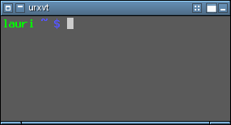
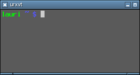

<h1 class="firstHeading">Help:Configuration</h1>

<h3 id="siteSub">From Openbox</h3>

Jump to: <a href="#column-one">navigation</a>, <a href="#searchInput">search</a>

Openbox configuration is made essentially by modifying just one file called <i>rc.xml</i>. Default configuration file can by default be found in <i>/etc/xdg/openbox/</i> and a user specific file can be placed in <i>~/.config/openbox/</i>. By default there is also menu.xml which is for menu configuration. Menu configuration is separated from rest of the configs. <i>rc.xml</i> is separated into different sections. All the options are discussed below with examples.

<table id="toc" class="toc"><tr><td>
<h2>Contents</h2>

<ul>
<li class="toclevel-1 tocsection-1"><a href="#Resistance">1 Resistance</a></li>
<li class="toclevel-1 tocsection-2"><a href="#Focus">2 Focus</a></li>
<li class="toclevel-1 tocsection-3"><a href="#Placement">3 Placement</a></li>
<li class="toclevel-1 tocsection-4"><a href="#Theme">4 Theme</a></li>
<li class="toclevel-1 tocsection-5"><a href="#Desktops">5 Desktops</a></li>
<li class="toclevel-1 tocsection-6"><a href="#Resize_.28and_move.29">6 Resize (and move)</a></li>
<li class="toclevel-1 tocsection-7"><a href="#Applications">7 Applications</a></li>
<li class="toclevel-1 tocsection-8"><a href="#Keyboard">8 Keyboard</a></li>
<li class="toclevel-1 tocsection-9"><a href="#Mouse">9 Mouse</a></li>
<li class="toclevel-1 tocsection-10"><a href="#Margins">10 Margins</a></li>
<li class="toclevel-1 tocsection-11"><a href="#Menu">11 Menu</a></li>
<li class="toclevel-1 tocsection-12"><a href="#Dock">12 Dock</a></li>
<li class="toclevel-1 tocsection-13"><a href="#Coordinates">13 Coordinates</a></li>
</ul>
</td></tr></table>
<h2>  Resistance </h2>
<pre>
&lt;resistance&gt;
  &lt;strength&gt;10&lt;/strength&gt;
  &lt;screen_edge_strength&gt;20&lt;/screen_edge_strength&gt;
&lt;/resistance&gt;
</pre>

<b>strength</b> Tells Openbox how much resistance (in pixels) there is between two windows before it lets them overlap. 
<b>screen_edge_strength</b> Basically the same as <i>strength</i> but between window and the screen edge.

<h2>  Focus </h2>
<pre>
&lt;focus&gt;
  &lt;focusNew&gt;yes&lt;/focusNew&gt;
  &lt;focusLast&gt;yes&lt;/focusLast&gt;
  &lt;followMouse&gt;no&lt;/followMouse&gt;
  &lt;focusDelay&gt;200&lt;/focusDelay&gt;
  &lt;underMouse&gt;no&lt;/underMouse&gt;
  &lt;raiseOnFocus&gt;no&lt;/raiseOnFocus&gt;
&lt;/focus&gt;
</pre>

<b>focusNew</b> Openbox will automatically give focus to new windows when they are created, otherwise the focus will stay as it is. 
<b>followMouse</b> Makes focus follow mouse. e.g. when the mouse is being moved the focus will be given to window under the mouse cursor. 
<b>focusLast</b> When switching desktops, focus the last focused window on that desktop again, regardless of where the mouse is. Only applies <i>followMouse</i> is set. 
<b>focusDelay</b> The time (in milliseconds) Openbox will wait before giving focus to the window under mouse cursor. Only applies if <i>followMouse</i> is set. 
<b>underMouse</b> Focus windows under the mouse not only when the mouse moves, but also when it enters another window due to other reasons (e.g. the window the mouse was in moved/closed/iconified etc). Only applies if <i>followMouse</i> is set. 
<b>raiseOnFocus</b> Also raises windows to top when they are focused. Only applies if <i>followMouse</i> is set.

<h2>  Placement </h2>
<pre>
&lt;placement&gt;
  &lt;policy&gt;Smart&lt;/policy&gt;
  &lt;center&gt;no&lt;/center&gt;
&lt;/placement&gt;
</pre>

<b>policy</b> can be either <i>Smart</i> or <i>UnderMouse</i>. 

<ul><li> <i>Smart</i> will cause new windows to be placed automatically by Openbox. 
</li><li> <i>UnderMouse</i> makes new windows to be placed under the mouse cursor.
</li></ul>

<b>center</b> can be either <i>yes</i> or <i>no</i>. If it is enabled, windows will open centered in the free area found.

<h2>  Theme </h2>
<pre>
&lt;theme&gt;
  &lt;name&gt;Clearlooks&lt;/name&gt;
  &lt;titleLayout&gt;NLIMC&lt;/titleLayout&gt;
  &lt;keepBorder&gt;yes&lt;/keepBorder&gt;
  &lt;animateIconify&gt;yes&lt;/animateIconify&gt;
  &lt;font place=&quot;ActiveWindow&quot;&gt;
    &lt;name&gt;sans&lt;/name&gt;
    &lt;size&gt;8&lt;/size&gt;
    &lt;weight&gt;bold&lt;/weight&gt;
    &lt;slant&gt;normal&lt;/slant&gt;
  &lt;/font&gt;
  &lt;font place=&quot;InactiveWindow&quot;&gt;
    &lt;name&gt;sans&lt;/name&gt;
    &lt;size&gt;8&lt;/size&gt;
    &lt;weight&gt;bold&lt;/weight&gt;
    &lt;slant&gt;normal&lt;/slant&gt;
  &lt;/font&gt;
  &lt;font place=&quot;MenuHeader&quot;&gt;
    &lt;name&gt;sans&lt;/name&gt;
    &lt;size&gt;9&lt;/size&gt;
    &lt;weight&gt;normal&lt;/weight&gt;
    &lt;slant&gt;normal&lt;/slant&gt;
  &lt;/font&gt;
  &lt;font place=&quot;MenuItem&quot;&gt;
    &lt;name&gt;sans&lt;/name&gt;
    &lt;size&gt;9&lt;/size&gt;
    &lt;weight&gt;normal&lt;/weight&gt;
    &lt;slant&gt;normal&lt;/slant&gt;
  &lt;/font&gt;
  &lt;font place=&quot;OnScreenDisplay&quot;&gt;
    &lt;name&gt;sans&lt;/name&gt;
    &lt;size&gt;9&lt;/size&gt;
    &lt;weight&gt;bold&lt;/weight&gt;
    &lt;slant&gt;normal&lt;/slant&gt;
  &lt;/font&gt;
&lt;/theme&gt;
</pre>

<b>name</b> The name of the Openbox theme to use. 

<b>titleLayout</b> tells in which order and what buttons should be in a window's titlebar. The following letters can be used, each only once.

  
titleLayout example using &lt;titleLayout&gt;MSLDNI&lt;/titleLayout&gt;

  
another titleLayout example using &lt;titleLayout&gt;CLIM&lt;/titleLayout&gt;

<ul><li>N&#160;:window icon
</li><li>L&#160;:window label (aka. title)
</li><li>I: iconify
</li><li>M: maximize
</li><li>C: close
</li><li>S: shade (roll up/down)
</li><li>D: omnipresent (on all desktops).
</li></ul>

<b>keepBorder</b> tells if windows should keep the border drawn by Openbox when window decorations are turned off. 
<b>animateIconify</b> adds a little iconification animation if enabled.
<i>font</i> Specifies the font to use for a specific element of the window. Place can be either of

<ul><li>ActiveWindow: Title bar of the active window
</li><li>InactiveWindow: Title bar of the inactive window
</li><li>MenuHeader: Titles in the menu
</li><li>MenuItem: Items in the menu
</li><li>OnScreenDisplay: Text in popups such as window cycling or desktop switching popups
</li></ul>

Childnodes for each place are name, specifying the font to use (defaults to sans, an alias for all sans serif fonts), size in px, weight, either normal or bold and slant, either italic or normal.

Themes themselves are described on the <a href="Themes" title="Help:Themes">theme specification</a> page.

<h2>  Desktops </h2>
<pre>
&lt;desktops&gt;
  &lt;number&gt;4&lt;/number&gt;
  &lt;firstdesk&gt;1&lt;/firstdesk&gt;
  &lt;popupTime&gt;1000&lt;/popupTime&gt;
  &lt;names&gt;
    &lt;name&gt;work&lt;/name&gt;
    &lt;name&gt;play&lt;/name&gt;
    &lt;name&gt;dull&lt;/name&gt;
    &lt;name&gt;boy&lt;/name&gt;
  &lt;/names&gt;
&lt;/desktops&gt;
</pre>

<b>number</b> The number of virtual desktops to use. 
<b>firstdesk</b> The number of the desktop to use when first started. 
<b>popupTime</b> Time (in milliseconds) to show the popup when switching desktops. Can be set to 0 to disable the popup completely. 
<b>names</b> Each <b>name</b> tag names your desktops, in ascending order. Unnamed desktops will be named automatically depending on the locale. You can name more desktops than specified in <i>number</i> if you want.

<h2>  Resize (and move) </h2>
<pre>
&lt;resize&gt;
  &lt;drawContents&gt;no&lt;/drawContents&gt;
  &lt;popupShow&gt;Always&lt;/popupShow&gt;
  &lt;popupPosition&gt;Fixed&lt;/popupPosition&gt;
  &lt;popupFixedposition&gt;
    &lt;x&gt;400&lt;/x&gt;
    &lt;y&gt;center&lt;/y&gt;
  &lt;/popupFixedPosition&gt;
&lt;/resize&gt;
</pre>

<b>drawContents</b> Resize the program inside the window while resizing. When disabled the unused space will be filled with a uniform color during a resize. 
<b>popupShow</b> When to show the move/resize popup. <i>Always</i> always shows it, <i>Never</i> never shows it, <i>Nonpixel</i> shows it only when resizing windows that have specified they are resized in increments larger than one pixel, usually terminals. 
<b>popupPosition</b> Where to show the popup.

<ul><li> <i>Top</i> shows the popup above the titlebar of the window.
</li><li> <i>Center</i> shows it centered on the window.
</li><li> <i>Fixed</i> shows it in a fixed location on the screen specified by <i>popupFixedPosition</i>.
</li></ul>

<b>popupFixedPosition</b> Specifies where on the screen to show the position when <i>Fixed</i>. Both <i>x</i> and <i>y</i> take coordinates as described <a href="#Coordinates">here</a>.

<h2>  Applications </h2>

This section sets specific settings for applications, and is quite complicated, so it has <a href="Applications" title="Help:Applications">its own page</a>.

<h2>  Keyboard </h2>
<pre>
&lt;keyboard&gt;
  &lt;rebindOnMappingNotify&gt;yes&lt;/rebindOnMappingNotify&gt;
  &lt;chainQuitKey&gt;C-g&lt;/chainQuitKey&gt;
  &lt;keybind ...
    ...
  &lt;/keybind&gt;
&lt;/keyboard&gt;
</pre>

<b>rebindOnMappingNotify</b> If this is enabled, keybinds will be rebound if the keyboard layout changes at runtime. It is enabled by default. 

The rest of this section contains keyboard shortcuts and is described on the <a href="Bindings#Key_bindings" title="Help:Bindings">bindings page</a>.

<h2>  Mouse </h2>
<pre>
&lt;mouse&gt;
  &lt;dragThreshold&gt;8&lt;/dragThreshold&gt;
  &lt;doubleClickTime&gt;200&lt;/doubleClickTime&gt;
  &lt;screenEdgeWarpTime&gt;400&lt;/screenEdgeWarpTime&gt;
  &lt;context ...
    ...
  &lt;/context&gt;
&lt;/mouse&gt;
</pre>

<b>dragThreshold</b> How many pixels you need to drag for it to be recognized as a drag operation. 
<b>doubleClickTime</b> Time (in milliseconds) allowed between two separate clicks to register as a DoubleClick. 
<b>screenEdgeWarpTime</b> Time (in milliseconds) to pause between two consecutive desktop switches done by holding the cursor next to the screen edge. Set to 0 to disable this feature. 
The rest of this section contains mouse bindings and is described on the <a href="Bindings#Mouse_bindings" title="Help:Bindings">bindings page</a>.

<h2>  Margins </h2>
<pre>
&lt;margins&gt;
  &lt;top&gt;50&lt;/top&gt;
  &lt;left&gt;0&lt;/left&gt;
  &lt;right&gt;20&lt;/right&gt;
  &lt;bottom&gt;0&lt;/bottom&gt;
&lt;/margins&gt;
</pre>

Each tag specifies the amount of pixels to reserve at the respective edge of the screen. New windows will not be placed in those areas, and maximized windows will not cover them.

<h2>  Menu </h2>
<pre>
&lt;menu&gt;
  &lt;hideDelay&gt;250&lt;/hideDelay&gt;
  &lt;middle&gt;no&lt;/middle&gt;
  &lt;submenuShowDelay&gt;100&lt;/submenuShowDelay&gt;
  &lt;submenuHideDelay&gt;400&lt;/submenuHideDelay&gt;
  &lt;applicationIcons&gt;yes&lt;/applicationIcons&gt;
  &lt;manageDesktops&gt;yes&lt;/manageDesktops&gt;
  &lt;file&gt;menu.xml&lt;/file&gt;
&lt;/menu&gt;
</pre>

<b>hideDelay</b> How long (in milliseconds) you have to hold the mouse button down for it to be hidden automatically when you release it. If you hold shorter, it will stay up when you release. 
<b>middle</b> Position menus centered vertically instead of aligned to the top. 
<b>submenuShowDelay</b> and <b>submenuHideDelay</b> affect how submenus pop up when moving across them. When moving away from a submenu it is closed after <b>submenuHideDelay</b>, and when moving into one, it is opened after <b>submenuShowDelay</b>. When moving from one submenu to another, the hide delay is only used if it is lower than the show delay (e.g. by default it is not used). The old submenu is closed after <i>HideDelay</i> milliseconds, and after <i>ShowDelay</i> milliseconds (after moving) the new one is shown (and the old one is hidden even if <i>HideDelay</i> has not expired yet). 
<b>applicationIcons</b> Whether to show window icons in the Desktop and Windows menus (client-list-menu and client-list-combined-menu). 
<b>manageDesktops</b> Whether to show the <i>Add new desktop</i> and <i>Remove last desktop</i> entries in the Desktop and Windows menus. 
<b>file</b> Specify files to load menu specifications from. Can be given more than once, although care should be taken to avoid id clashes. Files are searched for in the user directory first and then in the system directory.

<h2>  Dock </h2>
<pre>
&lt;dock&gt;
  &lt;position&gt;TopLeft&lt;/position&gt;
  &lt;stacking&gt;Normal&lt;/stacking&gt;
  &lt;direction&gt;Vertical&lt;/direction&gt;
  &lt;floatingX&gt;0&lt;/floatingX&gt;
  &lt;floatingY&gt;0&lt;/floatingY&gt;
  &lt;autoHide&gt;no&lt;/autoHide&gt;
  &lt;hideDelay&gt;300&lt;/hideDelay&gt;
  &lt;showDelay&gt;300&lt;/showDelay&gt;
  &lt;moveButton&gt;Button8&lt;/moveButton&gt;
  &lt;noStrut&gt;yes&lt;/noStrut&gt;
&lt;/dock&gt;
</pre>

The dock is only shown when one or more <a href="FAQ#What_is_this_dock_I_hear_so_much_about.3F" title="Help:FAQ">dockapps</a> are running. 
<b>position</b> Specify where to show the dock. Can be one of <i>TopLeft</i>, <i>Top</i>, <i>TopRight</i>, <i>Right</i>, <i>BottomRight</i>, <i>Bottom</i>, <i>BottomLeft</i>, <i>Left</i> and <i>Floating</i>. 
<b>stacking</b> Which window layer to put the dock in. Can be one of <i>above</i>, <i>normal</i>, <i>below</i>. The dock can be raised and lowered by left and middle clicking on it, among windows in the specified layer. 
<b>direction</b> Specify if dockapps should be laid out in a <i>Vertical</i> or <i>Horizontal</i> direction. 
<b>floatingX</b> and <b>floatingY</b> When <i>position</i> is set to <i>Floating</i>, these specify the pixel position of the dock. Cannot currently use the slightly extended format described at the bottom of this page. 
<b>autoHide</b> Whether to hide the dock automatically when the mouse is not over it. 
<b>hideDelay</b> and <b>showDelay</b> specify (in milleseconds) the delays for hiding and showing the dock when the mouse leaves and enters it, respectively. 
<b>moveButton</b> Specifies which button to use for moving individual dockapps around in the dock, see the <a href="Bindings#Button" title="Help:Bindings">bindings page</a> for details. 
<b>noStrut</b> Specifies that the dock should not set a strut, which means it won't stop windows from being placed or maximized over it. When <i>position</i> is set to <i>Floating</i>, this is always on, since openbox doesn't guess which edge it should belong to based on just the position. You can use <a href="#Margins">margins</a> to emulate that if you want.

<h2>  Coordinates </h2>

Many places in openbox that take a coordinate supports a slightly extended format. Most simply it can be just a number such as <i>300</i>. Such a coordinate will be left- or top-aligned depending on which coordinate it is. To align to the opposite edge, use <i>-300</i>. To specify a negative offset, a <i>-</i> is also used, so you have to use <i>+-10</i> to offset 10 pixels negatively to the left/top and <i>--10</i> for the right/bottom edge. Some things enforce being onscreen though, such as the move/resize popup.

