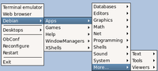

<h1 class="firstHeading">Help:Menus/Debian-menu</h1>

<h3 id="siteSub">From Openbox</h3>

Jump to: <a href="#column-one">navigation</a>, <a href="#searchInput">search</a>

  

Example of Debian menu

Source installs or prepackaged .debs from openbox.org will not configure your setup to show the Debian menu. There are a few simple steps to get it working.

<h2>  If you have already installed openbox with a working Debian menu </h2>

Add the following line to your "<code>~/.config/openbox/menu.xml</code>" file (if it isn't there, copy it from "<code>/etc/xdg/openbox/menu.xml</code>" file):

<pre> &lt;menu id="/Debian" /&gt;
</pre>

You should place the line, where you would like it to appear in the root menu. Location matters!

Add one of following lines to your "<code>~/.config/openbox/rc.xml</code>" file between the "<code>&lt;menu&gt;</code>" and "<code>&lt;/menu&gt;</code>" tags, before the code "<code>&lt;file&gt;menu.xml&lt;/file&gt;</code>":

<pre> &lt;file&gt;/var/lib/openbox/debian-menu.xml&lt;/file&gt;
 &lt;file&gt;debian-menu.xml&lt;/file&gt;
</pre>

The second line allows you to copy the "<code>debian-menu.xml</code>" file from "<code>/var/lib/openbox</code>" to your local "<code>~/.config/openbox</code>" directory, where it becomes static (command <code>update-menus</code> will not affect it). You can then edit it by hand and your changes will be permanent.

That's all you should have to do, though it's a good idea to run command <code>update-menus</code> (from package "<code>menu</code>") as root every now and then, if you don't have a cron job assigned. It refreshes the list of currently installed apps.

Then choose "<code>reconfigure</code>" on your root menu, and you should get a Debian submenu within the root menu.

<h2>  If you haven't had a working debian menu </h2>

This is a little trickier, but no big deal.

Then there's this little humdinger: you'll need to get a copy of an executable script named "openbox" and copy it to "<code>/etc/menu-methods</code>" directory. The script actually creates the Debian menu, when you run "<code>update-menus</code>.

<dl><dt> Method 1
</dt></dl>

The easiest way is to install Openbox from official debian repository using "<code>apt</code>", "<code>aptitude</code>", "<code>synaptic</code>" or other program. This will normally ensure, that you have all the packages required to create and use the Debian menu. 

After installation copy the script (from "<code>/etc/menu-methods</code>" directory) in a known directory (your home directory will fine), then uninstall the official openbox (with "<code>apt</code>", "<code>aptitude</code>", "<code>synaptic</code>" or other). 

Then, copy the script back to "<code>/etc/menu-methods</code>" directory and finally, issue the command <code>update-menus</code> as root.

<dl><dt> Method 2
</dt></dl>

If you don't want to do that, download an official Openbox package (.deb) from debian.org, create a dummy directory in "<code>/tmp</code>" and type the command

<pre> dpkg-deb -x /path/to/official-openbox.deb &lt; /tmp/dummy_dir
</pre>

This will unpack a mini-filesystem, that includes the script you need, in "<code>/tmp/dummy_dir/etc/menu-methods</code>" directory. Set its execution permissions, copy the script to "<code>/etc</code>" directory and issue the command <code>update-menus</code> as root. The latter command will create the file "<code>/var/lib/openbox/debian-menu.xml</code>".

To set the execution permissions type:

<pre> chmod ug+x /tmp/dummy_dir/etc/openbox
</pre>

The reason to create a dummy directory is that running the <code>dpkg-deb -x</code> command will change the ownership of the directory to root. These could become a bit of a problem later; putting it in a subdirectory of "<code>/tmp</code>" makes that issue, inoffensive.

Also, you should make sure you have the following packages installed before running <code>update-menus</code>:

<ul><li> menu;
</li><li> menu-xdg.
</li></ul>

Now follow the instructions, listed <a href="#If_you_have_already_installed_openbox_with_a_working_Debian_menu">above</a>.

