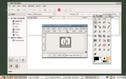
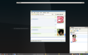
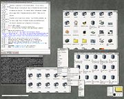

<h1 class="firstHeading">Help:Getting started</h1>

<h3 id="siteSub">From Openbox</h3>

Jump to: <a href="#column-one">navigation</a>, <a href="#searchInput">search</a>

Openbox is included in <a href="Distros_and_DEs_using_Openbox" title="Help:Distros and DEs using Openbox"> most popular linux distributions</a>.  However if the latest version is not available to you through your distribution, you can download it from the <a href="{{site.baseurl}}/download" title="Openbox:Download"> download page</a>.  Packages are available there for a few distrubutions, as well as the source code which you can compile yourself.  For help compiling Openbox, please see our <a href="Installing" title="Help:Installing" class="mw-redirect"> compiling guide</a>.

Once Openbox is installed, running it is quite simple whether you log in through the graphical interface or through a text-based terminal. We'll first talk about the ways to run Openbox from a graphical log in (GDM/KDM), and then show how to run those same sessions from the command line.

<table id="toc" class="toc"><tr><td>
<h2>Contents</h2>

<ul>
<li class="toclevel-1 tocsection-1"><a href="#Starting_Openbox_from_a_graphical_log_in">1 Starting Openbox from a graphical log in</a>
<ul>
<li class="toclevel-2 tocsection-2"><a href="#Using_Openbox_in_a_desktop_environment_.28GNOME_and_KDE.29">1.1 Using Openbox in a desktop environment (GNOME and KDE)</a></li>
<li class="toclevel-2 tocsection-3"><a href="#Using_Openbox_without_a_desktop_environment_.28The_lightweight_approach.29">1.2 Using Openbox without a desktop environment (The lightweight approach)</a></li>
</ul>
</li>
<li class="toclevel-1 tocsection-4"><a href="#Starting_Openbox_without_the_graphical_log_in">2 Starting Openbox without the graphical log in</a></li>
<li class="toclevel-1 tocsection-5"><a href="#The_default_configuration">3 The default configuration</a></li>
<li class="toclevel-1 tocsection-6"><a href="#Further_reading">4 Further reading</a></li>
</ul>
</td></tr></table>
<h2>  Starting Openbox from a graphical log in </h2>

  

Figure 1: Log in options for Openbox

Openbox provides three menu options that will be in the Session Type menu when you are logging in, if they are available.  The "GNOME/Openbox" option will only be present if you have GNOME installed, and the "KDE/Openbox" option will appear only if KDE is installed.

<h3>  Using Openbox in a desktop environment (GNOME and KDE) </h3>

  

Figure 2: Openbox running in the GNOME desktop environment

  

Figure 3: Openbox running in the K Desktop Environment

Openbox can run inside the <a rel="nofollow" class="external text" href="http://www.gnome.org/">GNOME</a>, <a rel="nofollow" class="external text" href="http://www.kde.org/">KDE</a>, or <a rel="nofollow" class="external text" href="http://www.lxde.org/">LXDE</a> desktop environments, giving you all the power and features of Openbox alongside everything these desktop environments have to offer.  Options to run Openbox inside of these desktop environments are provided by default in the Session Type menu when logging in graphically, as seen in Figure 1.  Choosing the "GNOME/Openbox" or "KDE/Openbox" option will log into the respective desktop environment with Openbox replacing the default window manager.

If you use <a rel="nofollow" class="external text" href="http://wiki.lxde.org/en/LXDM">lxdm</a>, make sure it is version 0.3.0 or newer. Older versions had a <a rel="nofollow" class="external text" href="https://bugs.launchpad.net/ubuntu/+source/lxdm/+bug/556611">bug</a> which interfered with sessions other than LXDE. 

See <a href="Using_Openbox_in_GNOME" title="Help:Using Openbox in GNOME"> Using Openbox in GNOME</a>  for further tips and assistance.

<h3>  Using Openbox without a desktop environment (The lightweight approach) </h3>

  

Figure 4: Openbox running without a desktop environment

By default, a third "Openbox" option is provided in the Session Type menu when logging in graphically, as can be seen in Figure 1. This option will run a more
lightweight Openbox session without any desktop environment or session manager.

When choosing this option, the <a href="Autostart" title="Help:Autostart"> autostart</a> file is executed before launching Openbox, so that you can run any applications you want to start alongside Openbox and set up the environment as neccessary.  Openbox comes with a default autostart which sets up an environment for both GNOME and KDE applications to run properly in (if you have them installed), as well as providing support for SCIM language input.  See the <a href="Autostart" title="Help:Autostart"> autostart documentation</a> for more details on setting it up.

To have a taskbar on screen, install and use a panel program like gnome-panel, pypanel, perlpanel or fbpanel.

<h2>  Starting Openbox without the graphical log in </h2>

If you don't use a graphical log in, there are three programs included with Openbox for launching Openbox sessions similar to the three menu options discussed above.

Most likely if you are not using a graphical log in, then you are using startx to begin an X session. In that case you need to run Openbox from your <code>~/.xinitrc</code> file.  Rather than just running <code>openbox</code> however, you should choose from one of the three programs listed below:

<ul><li> <code>openbox-session</code>
</li></ul>

This runs an Openbox session without any desktop environment or session manager, which is like selecting "Openbox" from the graphical log in.  See the <a href="Autostart" title="Help:Autostart"> autostart documentation</a> for how to easily start applications along with Openbox.

<ul><li> <code>openbox-gnome-session</code>
</li></ul>

This runs a GNOME session with Openbox as the window manager, which is like selecting "GNOME/Openbox" from the graphical log in.

<ul><li> <code>openbox-kde-session</code>
</li></ul>

This runs a KDE session with Openbox as the window manager, which is like selecting "KDE/Openbox" from the graphical log in.

<h2>  The default configuration </h2>

Take a look at the <a href="DefaultConfiguration" title="Help:DefaultConfiguration"> details of the default configuration</a> to learn what the default keyboard bindings are.

<h2>  Further reading </h2>

There's a lot of help documentation on the site, in the <a href="Contents" title="Help:Contents"> help section</a>. Or see <a href="FAQ" title="Help:FAQ"> the FAQ</a> for solutions to common problems.

