
<h1 class="firstHeading">Help:Upgrading to 3.4</h1>

<h3 id="siteSub">From Openbox</h3>

Jump to: <a href="#column-one">navigation</a>, <a href="#searchInput">search</a>

Openbox 3.4 looks a lot like previous versions, but once you start using it, you will see that it is not.  There are a huge number of improvements and changes made in our 3.4 release. This guide goes through all these changes and what they mean for users, themers, and developers.

<a href="images/Cowsay.png" class="image">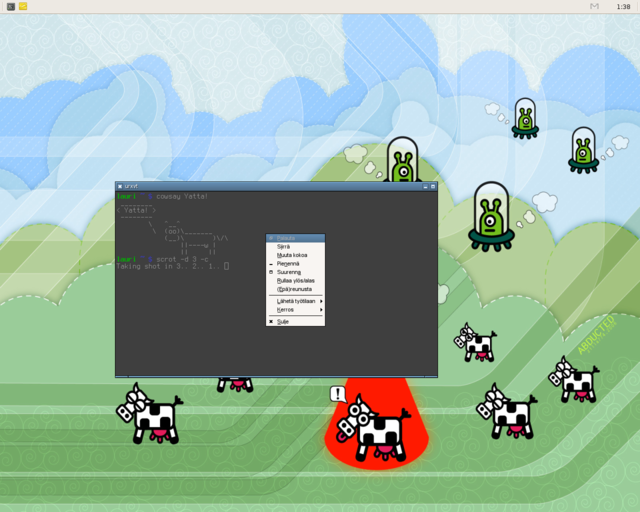</a>  

Openbox 3.4 with the Finnish translation. We need help translating Openbox to as many languages as possible. Please consider <a href="{{site.baseurl}}/contribute#Translations" title="Openbox:Contribute"> helping out</a>.

<table id="toc" class="toc"><tr><td>
<h2>Contents</h2>

<ul>
<li class="toclevel-1 tocsection-1"><a href="#The_.22I_don.27t_have_time_give_me_something_fast.22_approach">1 The "I don't have time give me something fast" approach</a></li>
<li class="toclevel-1 tocsection-2"><a href="#What.27s_new_in_version_3.4_.3F">2 What's new in version 3.4&#160;?</a>
<ul>
<li class="toclevel-2 tocsection-3"><a href="#Usability">2.1 Usability</a>
<ul>
<li class="toclevel-3 tocsection-4"><a href="#New_log-in_options">2.1.1 New log-in options</a></li>
<li class="toclevel-3 tocsection-5"><a href="#New_.22Alt-Tab.22_dialog">2.1.2 New "Alt-Tab" dialog</a></li>
<li class="toclevel-3 tocsection-6"><a href="#Faster_than_ever">2.1.3 Faster than ever</a></li>
<li class="toclevel-3 tocsection-7"><a href="#More_reliable">2.1.4 More reliable</a></li>
<li class="toclevel-3 tocsection-8"><a href="#Language_support">2.1.5 Language support</a></li>
<li class="toclevel-3 tocsection-9"><a href="#Transparent_windows">2.1.6 Transparent windows</a></li>
<li class="toclevel-3 tocsection-10"><a href="#Keeping_windows_on_screen">2.1.7 Keeping windows on screen</a></li>
<li class="toclevel-3 tocsection-11"><a href="#Improved_startup_notification">2.1.8 Improved startup notification</a></li>
<li class="toclevel-3 tocsection-12"><a href="#Running_applications_remotely">2.1.9 Running applications remotely</a></li>
<li class="toclevel-3 tocsection-13"><a href="#Improved_support_for_multiple_screens">2.1.10 Improved support for multiple screens</a></li>
<li class="toclevel-3 tocsection-14"><a href="#Complete_support_for_latest_EWMH">2.1.11 Complete support for latest EWMH</a></li>
<li class="toclevel-3 tocsection-15"><a href="#8-bit_TrueColor_support">2.1.12 8-bit TrueColor support</a></li>
<li class="toclevel-3 tocsection-16"><a href="#Legacy_fullscreen_applications">2.1.13 Legacy fullscreen applications</a></li>
<li class="toclevel-3 tocsection-17"><a href="#Omnipresent_windows">2.1.14 Omnipresent windows</a></li>
<li class="toclevel-3 tocsection-18"><a href="#Maximized_terminal_windows">2.1.15 Maximized terminal windows</a></li>
<li class="toclevel-3 tocsection-19"><a href="#Focus_cycling_to_panels_and_desktop_windows">2.1.16 Focus cycling to panels and desktop windows</a></li>
<li class="toclevel-3 tocsection-20"><a href="#Session_saving_and_restoring">2.1.17 Session saving and restoring</a></li>
<li class="toclevel-3 tocsection-21"><a href="#Cycling_across_all_desktops">2.1.18 Cycling across all desktops</a></li>
<li class="toclevel-3 tocsection-22"><a href="#Desktop_cycling_dialog">2.1.19 Desktop cycling dialog</a></li>
<li class="toclevel-3 tocsection-23"><a href="#Animated_iconify_and_restore">2.1.20 Animated iconify and restore</a></li>
<li class="toclevel-3 tocsection-24"><a href="#Focus_aware_applications">2.1.21 Focus aware applications</a></li>
<li class="toclevel-3 tocsection-25"><a href="#Resizing_on_the_window.27s_edges">2.1.22 Resizing on the window's edges</a></li>
<li class="toclevel-3 tocsection-26"><a href="#Windows_without_icons">2.1.23 Windows without icons</a></li>
<li class="toclevel-3 tocsection-27"><a href="#Synchronized_window_resizing">2.1.24 Synchronized window resizing</a></li>
<li class="toclevel-3 tocsection-28"><a href="#Improved_.22Show_Desktop.22">2.1.25 Improved "Show Desktop"</a></li>
<li class="toclevel-3 tocsection-29"><a href="#Key_chain_dialog">2.1.26 Key chain dialog</a></li>
<li class="toclevel-3 tocsection-30"><a href="#Chroot_key_chains_and_key_quoting">2.1.27 Chroot key chains and key quoting</a></li>
<li class="toclevel-3 tocsection-31"><a href="#Auto-hiding_decorations">2.1.28 Auto-hiding decorations</a></li>
<li class="toclevel-3 tocsection-32"><a href="#MoveFromEdge_actions">2.1.29 MoveFromEdge actions</a></li>
<li class="toclevel-3 tocsection-33"><a href="#Moving_maximized_windows">2.1.30 Moving maximized windows</a></li>
<li class="toclevel-3 tocsection-34"><a href="#Root_context_for_mouse_bindings">2.1.31 Root context for mouse bindings</a></li>
<li class="toclevel-3 tocsection-35"><a href="#Helper_windows">2.1.32 Helper windows</a></li>
<li class="toclevel-3 tocsection-36"><a href="#Mangling_desktop_configuration">2.1.33 Mangling desktop configuration</a></li>
<li class="toclevel-3 tocsection-37"><a href="#--reconfigure_option">2.1.34 --reconfigure option</a></li>
<li class="toclevel-3 tocsection-38"><a href="#--restart_option">2.1.35 --restart option</a></li>
</ul>
</li>
<li class="toclevel-2 tocsection-39"><a href="#Menus">2.2 Menus</a>
<ul>
<li class="toclevel-3 tocsection-40"><a href="#Combined_client_list_menu">2.2.1 Combined client list menu</a></li>
<li class="toclevel-3 tocsection-41"><a href="#Iconified_windows_in_the_client_list_menus">2.2.2 Iconified windows in the client list menus</a></li>
<li class="toclevel-3 tocsection-42"><a href="#Keyboard_accelerators_.28using_letters_instead_of_arrows.29">2.2.3 Keyboard accelerators (using letters instead of arrows)</a></li>
<li class="toclevel-3 tocsection-43"><a href="#No_more_menu_titles">2.2.4 No more menu titles</a></li>
<li class="toclevel-3 tocsection-44"><a href="#Startup_notification">2.2.5 Startup notification</a></li>
<li class="toclevel-3 tocsection-45"><a href="#New_client_menu">2.2.6 New client menu</a></li>
<li class="toclevel-3 tocsection-46"><a href="#Selecting_disabled_menu_items">2.2.7 Selecting disabled menu items</a></li>
<li class="toclevel-3 tocsection-47"><a href="#Menu_placement">2.2.8 Menu placement</a></li>
<li class="toclevel-3 tocsection-48"><a href="#Large_menus">2.2.9 Large menus</a></li>
</ul>
</li>
<li class="toclevel-2 tocsection-49"><a href="#Themes">2.3 Themes</a>
<ul>
<li class="toclevel-3 tocsection-50"><a href="#New_default_theme">2.3.1 New default theme</a></li>
<li class="toclevel-3 tocsection-51"><a href="#User_specified_fonts">2.3.2 User specified fonts</a></li>
<li class="toclevel-3 tocsection-52"><a href="#Distributed_themes_renamed">2.3.3 Distributed themes renamed</a></li>
<li class="toclevel-3 tocsection-53"><a href="#New_tricks_for_.22ParentRelative.22_textures">2.3.4 New tricks for "ParentRelative" textures</a></li>
<li class="toclevel-3 tocsection-54"><a href="#New_theme_elements_for_on-screen-displays">2.3.5 New theme elements for on-screen-displays</a></li>
<li class="toclevel-3 tocsection-55"><a href="#New_theme_elements_for_toggled_buttons">2.3.6 New theme elements for toggled buttons</a></li>
<li class="toclevel-3 tocsection-56"><a href="#menu.border.color">2.3.7 menu.border.color</a></li>
<li class="toclevel-3 tocsection-57"><a href="#window.active.border.color">2.3.8 window.active.border.color</a></li>
<li class="toclevel-3 tocsection-58"><a href="#window.active.title.separator.color">2.3.9 window.active.title.separator.color</a></li>
<li class="toclevel-3 tocsection-59"><a href="#window.inactive.border.color">2.3.10 window.inactive.border.color</a></li>
<li class="toclevel-3 tocsection-60"><a href="#window.inactive.title.separator.color">2.3.11 window.inactive.title.separator.color</a></li>
<li class="toclevel-3 tocsection-61"><a href="#menu.border.width">2.3.12 menu.border.width</a></li>
<li class="toclevel-3 tocsection-62"><a href="#menu.items.active.disabled.text.color">2.3.13 menu.items.active.disabled.text.color</a></li>
<li class="toclevel-3 tocsection-63"><a href="#Even_sized_titlebar_buttons">2.3.14 Even sized titlebar buttons</a></li>
<li class="toclevel-3 tocsection-64"><a href="#New_default_titlebar_button_images">2.3.15 New default titlebar button images</a></li>
<li class="toclevel-3 tocsection-65"><a href="#Improvements_in_the_distributed_themes">2.3.16 Improvements in the distributed themes</a></li>
</ul>
</li>
<li class="toclevel-2 tocsection-66"><a href="#Configuration">2.4 Configuration</a>
<ul>
<li class="toclevel-3 tocsection-67"><a href="#New_contexts">2.4.1 New contexts</a></li>
<li class="toclevel-3 tocsection-68"><a href="#New_fonts">2.4.2 New fonts</a></li>
<li class="toclevel-3 tocsection-69"><a href="#NextWindow_for_all_desktops">2.4.3 NextWindow for all desktops</a></li>
<li class="toclevel-3 tocsection-70"><a href="#NextWindow_and_DirectionalFocus_for_panels_and_desktop_windows">2.4.4 NextWindow and DirectionalFocus for panels and desktop windows</a></li>
<li class="toclevel-3 tocsection-71"><a href="#Chrooted_key_chains_and_BreakChroot_action">2.4.5 Chrooted key chains and BreakChroot action</a></li>
<li class="toclevel-3 tocsection-72"><a href="#New_Root_context">2.4.6 New Root context</a></li>
<li class="toclevel-3 tocsection-73"><a href="#Windows_key_in_key_bindings">2.4.7 Windows key in key bindings</a></li>
<li class="toclevel-3 tocsection-74"><a href="#hideDisabled_removed">2.4.8 hideDisabled removed</a></li>
<li class="toclevel-3 tocsection-75"><a href="#edges_hit_layers_below_removed">2.4.9 edges_hit_layers_below removed</a></li>
<li class="toclevel-3 tocsection-76"><a href="#Settings_for_specific_windows_.28Per-application_settings.29">2.4.10 Settings for specific windows (Per-application settings)</a>
<ul>
<li class="toclevel-4 tocsection-77"><a href="#Matching_windows_with_wildcards">2.4.10.1 Matching windows with wildcards</a></li>
<li class="toclevel-4 tocsection-78"><a href="#Matching_against_multiple_rules">2.4.10.2 Matching against multiple rules</a></li>
<li class="toclevel-4 tocsection-79"><a href="#Per-monitor_positioning_changed">2.4.10.3 Per-monitor positioning changed</a></li>
<li class="toclevel-4 tocsection-80"><a href="#The_.22default.22_value">2.4.10.4 The "default" value</a></li>
</ul>
</li>
</ul>
</li>
</ul>
</li>
</ul>
</td></tr></table>
<h1>  The "I don't have time give me something fast" approach </h1>

There are a number of new things that you won't be able to take advantage of without updating your configuration file.  One quick and easy way to get these features is to just delete your <code>~/.config/openbox/rc.xml</code> configuration file and set your config back up from there with <a href="{{site.baseurl}}/obconf" title="ObConf:About"> Obconf</a> or by hand.

You can use the default configuration file, installed to <code>/etc/xdg/openbox/rc.xml</code> if you use click-to-focus.  However if you use focus-follows-mouse, the <code>/usr/share/doc/openbox/rc-mouse-focus.xml</code> file may make a better template for you to work with.

Take a look at the <a href="DefaultConfiguration" title="Help:DefaultConfiguration"> details of the default configuration</a> to learn what the default keyboard bindings are.

<h1>  What's new in version 3.4&#160;? </h1>

Our <a href="Getting_started" title="Help:Getting started"> getting started guide</a> is a great place to start learning the best ways to start an Openbox session.  If you've been running a previous version of Openbox, you can keep using the methods you have been and everything will work, but there are also some new features that you may wish to take advantage of, especially in terms of how you log into or run an Openbox session.

During the development cycle for Openbox 3.4, we fixed and closed every bug listed in the bug tracker from previous versions. There's a big list of the bugs in the <a href="{{site.baseurl}}/changelog" title="Openbox:Changelog">Openbox:Changelog</a>, and we're not going to go through them all here. We're going to talk about the new things.

<h2>  Usability </h2>
<h3>  New log-in options </h3>

Openbox now provides three ways to start an Openbox session through a graphical login manager, or through the command line.  These new methods to start Openbox are detailed in the <a href="Getting_started" title="Help:Getting started"> getting started guide</a> which you should definitely take a look at.

When logging in through KDM, GDM or some other graphical log-in system, you no longer have to set up a <code>~/.xsession</code> file to get a usable Openbox session.  You can select the "Openbox" entry in the Session Type menu, and support for various applications, as well as <a href="#SCIM_support"> SCIM</a> are automatically included in your log in.  The <code>openbox-session</code> provides these same capabilities from the command line.  See the <a href="Autostart" title="Help:Autostart"> autostart documentation</a> to see how Openbox does this, and how to launch your own choice applications along with Openbox when you log in.

Other new log-in options are the "KDE/Openbox" option, which opens a KDE session with Openbox as your window manager and the "GNOME/Openbox" option which opens a GNOME session with Openbox as your window manager.  These can also be accessed through the <code>openbox-kde-session</code> and <code>openbox-gnome-session</code> commands.

See the <a href="Getting_started" title="Help:Getting started"> getting started guide</a>, even if Openbox is not new to you, to see more about these startup options and what they provide - especially the new "Openbox" (from graphical login) or <code>openbox-session</code> option.

<h3>  New "Alt-Tab" dialog </h3>

<a href="images/NewFocusDialog.png" class="image">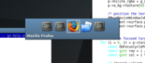</a>  

The new focus cycling dialog

Openbox 3.4 sports a brand new dialog for cycling between windows.  This new dialog shows icons for all windows you can switch to instead of just showing the icon for the current target.  You can see the new dialog in action to the right.

The dialog shows when you press the Alt-Tab or Alt-Shift-Tab keys in the default configuration.

<h3>  Faster than ever </h3>

Openbox has always been fast, but version 3.4 is faster than any before it.  A large number of improvements were made throughout the code that impact directly on how fast Openbox can do what it does.  A couple examples would be the window stacking code (how Openbox determines which windows to put on top of which) and our use of lists.

<h3>  More reliable </h3>

It's starting to sound like a Microsoft Windows ad, but in Openbox 3.4 we cleaned up a huge number of bug reports which had been sent in since the last release.  We also changed and rewrote a number of sections to improve their reliability, such as the focus handling and session manager interaction.

 

<h3>  Language support </h3>

Openbox now uses Pango exclusively for its font rendering, which means better support for displaying text from all languages.

This change allowed us to clean up the font rendering code a lot, and we've sped up the drawing routines significantly from previous Openbox versions.

<h3>  Transparent windows </h3>

<a href="images/TrueTransparentWindows.png" class="image">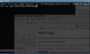</a>  

Openbox managing a window which uses true 32-bit transparency

Windows that use the new 32-bit true transparency provided by x.org servers are now supported by Openbox. You can see an example of urxvt running with true transparency in the picture to the right.

True 32-bit transparency is made possible through the Composite extension. So, in order to use this feature you need to run a composite manager, such as this (run it without any arguments if you don't want the extras like drop shadows):

<code><pre>xcompmgr -c -t-5 -l-5 -r4.2 -o.55 &amp;</pre></code>

Openbox itself is not a composite manager, though it may be some day.

<h3>  Keeping windows on screen </h3>

When windows adjust their dimensions, Openbox now takes care to make sure they don't end up off of the screen, unless the application explicitly requests it.  This keeps your desktop more usable, meaning you don't have to move windows around to use them so much, without interfering with letting you move windows outside the screen if you want to, like some other window managers do.

<h3>  Improved startup notification </h3>

<a href="images/KickerStartupNotification.png" class="image">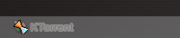</a>  

Startup notification at work. Kicker is showing that Ktorrent is starting up.

Openbox can now use startup notification when launching programs.  This means that when the application's window appears, Openbox will know when you began launching the program, and what desktop you were launching it on.  It also means that other programs, such as taskbars, can show feedback that an application is starting.

The <a href="#Startup_notification"> menu section</a> talks about how to use startup notification in your menus and key bindings.

Using startup notification for your menu entries also helps with focus stealing prevention. If you use it, then Openbox can keep the launching application's new window from stealing focus in the middle of your typing (and sending your password off to IRC for example).

  

Openbox used to use the "watch" icon from the core X cursors when a program was starting up, which is a very hard to use.  This has been changed in 3.4 so that the startup notification stays out of your way.  If you use an Xcursors theme, Openbox will use the busy cursor with an arrow, an example of which can be seen to the left.  And if you don't use an Xcursor theme, it won't change your cursor at all.

<h3>  Running applications remotely </h3>

<a href="images/HostnameInTitlebar.png" class="image">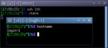</a>  

Openbox showing the application's host machine

If you run applications from another machine in your X session, Openbox will now display their host machine in the window's titlebar, as you can see in the image to the right.

<h3>  Improved support for multiple screens </h3>

If you have a multi-monitor setup, either with Xinerama (a.k.a. Twin View) or with independent screens, Openbox 3.4 has improved support for your setup.

Input focus handling has been made more robust all around in version 3.4, but especially with multiple screens in mind.  Openbox will no longer steal focus from other screens and you can click on the root window to give focus to a particular screen, with a mouse binding.  The default configuration lets you focus a screen by clicking on the desktop with your Left mouse button.

Window placement between Xinerama (a.k.a. Twin View) monitors has also been improved.  New windows will appear on the same monitor as other windows they are related to.  If they don't have related windows then they are placed where the input focus is, or where the mouse pointer is.

<h3>  Complete support for latest EWMH </h3>

Openbox 3.4 sports complete support for the latest freedesktop.org EWMH specification (version 1.4-draft2), as well as even some hints which will be in a future release!

This means that the latest features from applications will have full support from Openbox.

<h3>  8-bit TrueColor support </h3>

Environments such as VNC are often used in 8-bit display mode to reduce the network bandwidth they require.  VNC uses an 8-bit display mode called "TrueColor", which previous versions of Openbox did not support.  As of version 3.4 you can use Openbox in these 8-bit TrueColor environments, rather than forcing you to use the old "pseudocolor" paradigm.  This means that 8-bit VNC will work out of the box now.

<h3>  Legacy fullscreen applications </h3>

Openbox can now detect when applications are trying to be fullscreen, even when they don't use the EWMH fullscreen hints.  This means that applications, such as VLC (Video LAN Client) in fullscreen mode won't be covered by panels or other windows.

<h3>  Omnipresent windows </h3>

Omnipresent windows, or windows which are present across all desktops, have had their behavior improved in Openbox 3.4.  When changing desktops, these windows will no longer "steal" focus and hold onto it.

<h3>  Maximized terminal windows </h3>

Applications which resize in increments, such as x terminals have been made to full the screen properly when they are maximized.  This means that when the window is maximized, you will no longer have a little margin at the edge of the screen, where you can click and miss the window.  Some older terminal clients may not know what to do when they are resized outside of their increments, but most will already work fine, such as xterm, rxvt-unicode, and gnome-terminal.

<h3>  Focus cycling to panels and desktop windows </h3>

<a href="images/FocusCyclingToPanel.png" class="image">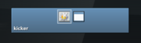</a>  

Focus cycling to a panel

New options have been added to the focus cycling actions to allow you to cycle between panels and desktop windows.  You can use Control-Alt-Tab to access this feature in the default configuration.  You can use these options with the traditional focus cycling behavior or with the directional focus cycling.

See the <a href="#NextWindow_and_DirectionalFocus_for_panels_and_desktop_windows"> configuration section</a> for details on how to set this up in your own key bindings.

<h3>  Session saving and restoring </h3>

Session saving and restoring has been revamped and improved in version 3.4.

Clients which do not use the session management protocol can now be saved and restored.  This applies to programs like rxvt-unicode, Firefox, and probably most applications which are not GNOME or KDE based.

Ksmserver (KDE's session manager) allows the window manager to be more precise in saving the session state. Openbox 3.4 takes advantage of this feature to improve session saving within KDE.

<h3>  Cycling across all desktops </h3>

<a href="images/FocusCyclingForAllDesktops.png" class="image">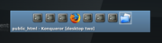</a>  

Focus cycling across all desktops

An option has been added to allow you to focus cycle between windows on all of your desktops.  This is not enabled in the default configuration, but you can easily add the &lt;allDesktops&gt; option to your NextWindow and PreviousWindow actions to enable this behavior. For example, to get this behavior in the default configuration you would change the Alt-Tab and Alt-Shift-Tab key bindings to this:

<code><pre>
  &lt;keybind key=&quot;A-Tab&quot;&gt;
    &lt;action name=&quot;NextWindow&quot;&gt;&lt;allDesktops&gt;yes&lt;/allDesktops&gt;&lt;/action&gt;
  &lt;/keybind&gt;
  &lt;keybind key=&quot;A-S-Tab&quot;&gt;
    &lt;action name=&quot;PreviousWindow&quot;&gt;&lt;allDesktops&gt;yes&lt;/allDesktops&gt;&lt;/action&gt;
  &lt;/keybind&gt;
</pre></code>

When you use this, the desktop which the window is on is appended to the window's title in the cycling dialog, as you can see in the image to the right.

This is also mentioned in the <a href="#NextWindow_for_all_desktops"> configuration section</a>.

<h3>  Desktop cycling dialog </h3>

In 3.4.4, the desktop cycling dialog's behavior has been changed again.  It will be shown for a fixed time whenever the desktop is changed, instead of going away when the keys are released.  This may or may not be something which you like, but it is necessary at the moment for many applications, such as Firefox.  You can see the nitty gritty details as to why <a rel="nofollow" class="external text" href="http://mail.gnome.org/archives/wm-spec-list/2007-May/msg00000.html">here</a>.  But this change, along with some others, means that applications will know when they do and don't have focus at all times, which will make them work properly, which we think is a good thing.

If you don't want the dialog, or want to change the timeout, edit the &lt;popupTime&gt; setting in the &lt;desktops&gt; setting, or use ObConf 2.0.3. Set it to 0 to disable it completely:

<code><pre>
&lt;desktops&gt;
  ... other settings ...
  &lt;popupTime&gt;400&lt;/popupTime&gt;
&lt;/desktops&gt;
</pre></code>
<h3>  Animated iconify and restore </h3>

A simple animation has been added for when windows are iconified or restored to visually display where the window has been iconified.

You can watch this  <a href="images/IconifyAnimation.ogg" class="internal" title="IconifyAnimation.ogg">video showing the animation</a> (in ogg format), to have an idea of what it looks like. The animation is very fast, so the video can only capture so much.

The animation is quick and not resource intensive.  But if you prefer to have your windows instantly appear and disappear, rather than animate, you can use the <code>&lt;animateIconify&gt;no&lt;/animateIconify&gt;</code> option in the &lt;theme&gt; section of your configuration file.

<h3>  Focus aware applications </h3>

Some applications like to track when they are focused or not, or which of their windows is focused.  Instant Messengers often do this, so that it can alert you when a message comes and the window is not focused.  Firefox also uses these same mechanisms to tell which window the user is working with.

Openbox 3.4 takes special care to make sure that applications always know when their windows gain and lose focus.  We mentioned one way that we go about this in the <a href="#Desktop_cycling_dialog"> usability</a> section.

Right now the standards and coordination for this between window managers and applications is non-existent, so Openbox takes every precaution it can to make sure that every application will work right.

<h3>  Resizing on the window's edges </h3>

Resizing grips have been added to all edges of your windows.  These are especially noticeable along the top edge of the titlebar, and in the top-left and top-right corners.  This makes resizing windows easier and faster with just the mouse.

You can also resize along the bottom and side edges of the window, though in most themes the sides are only a 1 pixel border, which can be hard to click on.

If you undecorate a window (an option in the client menu), by default the windows are given just a border.  This border can now also be used to resize the window.

In order to take advantage of these new resizing areas, however, you need to have bindings for them in your configuration file.  They are all used in the default configuration.  See the <a href="#New_contexts"> configuration section</a> for what to add to your own configuration to get these to work for you.

Resizing any edge can also be accomplished with the Alt-Right mouse button binding (in the default configuration).

<h3>  Windows without icons </h3>

<a href="images/IconlessWindows.png" class="image">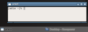</a>  

The default icon at work. The task list, Openbox and everyone else can agree for once.

Some applications don't set an icon on their window.  Generally, every application which would show the window's icon will choose some icon of its own in this case.  So Openbox would show one thing, your task bar a different icon, and maybe your pager would show a third icon, all for the same window.

Starting in Openbox 3.4, when a window does not provide any icon of its own, Openbox will set its icon to a default "window" icon, so that applications can agree on what to display for the window.

<h3>  Synchronized window resizing </h3>

If your application supports it, Openbox 3.4 will synchronize its resizing with the application to avoid excessive flicker.

You can, as always, also choose to have the application window not resized until you have finished resizing the frame with the <code>&lt;drawContents&gt;no&lt;/drawContents&gt;</code> in the &lt;resize&gt; section of your configuration file.

<h3>  Improved "Show Desktop" </h3>

Many panels provide a button to "show your desktop".  Openbox also provides this functionality through the Windows-D 1 key binding in the default configuration.

Show Desktop mode has been improved in Openbox 3.4.  When you go in and out of "Show Desktop" mode, Openbox will hide and show all your windows, the same as it always has.  But when you use "Show Desktop" mode to hide all your windows and then open a new window, the other windows will be iconified rather than unhidden.  This makes "Show Desktop" a quick way to unclutter your screen.

<small>1 The default bindings for the "Windows" key may not work with your "Windows" key (if you have one), depending on your setup.  The "W" in modifier in key bindings is actually a shortcut for the "Super" modifier key.  Most distributions bind the "Super" modifier key to the "Windows" key on 104-key PC keyboards, so this should just work for most people.
Also see <a href="#Windows_key_in_key_bindings"> the configuration section</a>.</small>

<h3>  Key chain dialog </h3>

  

The new key chain dialog, showing the first key sequence of a key chain

Openbox has supported emacs-style key chains for a long time.  However, new in 3.4 is a small popup dialog that visually shows you where you are in your key chain's sequence.

The dialog is small and shows up in the top left corner of your screen after a small delay.  So if you go through your key chains without too much waiting, you might never see it.

<h3>  Chroot key chains and key quoting </h3>

Openbox 3.4 introduces the ability to "chroot" your keychains.  This means that when you enter a chroot section of your key chain, Openbox will not leave the keychain automatically, and when you use keys further along the chain, it will stay within the chroot.

There are a number of examples of how this could be used, so you can get a better idea. You could use this to use the arrow keys to change desktops, for instance. A key chain setup such as:

<code><pre>
  &lt;keybind key=&quot;C-A-d&quot; chroot=&quot;true&quot;&gt;                                           
    &lt;keybind key=&quot;Up&quot;&gt;&lt;action name=&quot;DesktopUp&quot;&gt;&lt;dialog&gt;no&lt;/dialog&gt;&lt;/action&gt;&lt;/keybind&gt;                 
    &lt;keybind key=&quot;Down&quot;&gt;&lt;action name=&quot;DesktopDown&quot;&gt;&lt;dialog&gt;no&lt;/dialog&gt;&lt;/action&gt;&lt;/keybind&gt;                 
    &lt;keybind key=&quot;Left&quot;&gt;&lt;action name=&quot;DesktopLeft&quot;&gt;&lt;dialog&gt;no&lt;/dialog&gt;&lt;/action&gt;&lt;/keybind&gt;                 
    &lt;keybind key=&quot;Right&quot;&gt;&lt;action name=&quot;DesktopRight&quot;&gt;&lt;dialog&gt;no&lt;/dialog&gt;&lt;/action&gt;&lt;/keybind&gt;                 
    &lt;keybind key=&quot;Escape&quot;&gt;&lt;action name=&quot;BreakChroot&quot;/&gt;&lt;/keybind&gt;              
  &lt;/keybind&gt;
</pre></code>

This key chain would mean that when you pressed and released Control-Alt-D, you would enter a chroot.  From then on, other key bindings would not function, but the Arrow keys by themselves would move your around your desktops.  Pressing Escape or Control-G (in the default configuration) would take you back out of the chroot and return your key bindings to normal.

Another use for chroots is "key quoting".  This is used when you run an Openbox session in a window, such as a VNC client.  In order to use key bindings inside the VNC, generally, you have to make sure that they are different from the ones in your main Openbox session.

With key quoting, you can use the same key bindings in both. Here's an example:

<code><pre>
  &lt;keybind key=&quot;C-A-q&quot; chroot=&quot;true&quot;&gt;
    &lt;keybind key=&quot;C-A-q&quot;&gt;&lt;action name=&quot;BreakChroot&quot;/&gt;&lt;/keybind&gt;
  &lt;/keybind&gt;
</pre></code>

With this example, when you pressed Control-Alt-Q, Openbox would enter the chroot.  Then your normal Openbox key bindings would stop working and would instead be passed through to the VNC session (assuming you have it focused).  When you were done, you could press Control-Alt-Q again, and your normal key bindings would be restored in you main Openbox session.

The BreakChroot action is also new, and is just for breaking out of a chroot.  The global &lt;chainQuitKey&gt; (Control-G in the default configuration) can also be used for this.  However, the BreakChroot action is special in that it will only break out of <i>one</i> chroot.  So, if you have nested chroots, you can break out of only as many as you want, by placing 1 or more BreakChroot actions in a key binding.

The chroot changes are also talked about in the <a href="#Chrooted_key_chains_and_BreakChroot_action"> configuration section</a>.

<h3>  Auto-hiding decorations </h3>

<a href="images/HiddenTitlebarButtons.png" class="image">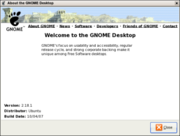</a>  

The maximize button has been hidden for this dialog. Using a "NLMC" titleLayout.

In Openbox 3.4 titlebar buttons can hide automatically.  This is done in such a way that they only hide if hiding won't move other buttons around.  This way you always know where to click to do the same thing, but when possible, the buttons can be hidden to reduce clutter.

We've removed the &lt;hideDisabled&gt; option from the &lt;theme&gt; section of the configuration file in favour of this auto-hiding.  This is also mentioned in the <a href="#hideDisabled_removed"> configuration section</a>.

The bottom handle is also hidden automatically now for windows that can't be resized, making their decorations cleaner and simpler.

<h3>  MoveFromEdge actions </h3>

<a href="images/MoveFromEdge.png" class="image">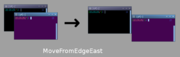</a>  

Using MoveFromEdgeEast

We added MoveFromEdge* actions corresponding to MoveToEdge* actions.  MoveToEdge actions let you move a window up against another window's edge (or the edge of the screen).  The new MoveFromEdge actions let you move a window that is overlapping another off to its side.  See the image to the right for a graphical desciption of what these actions do.

<b>Note:</b> these have been rolled into the MoveToEdge actions in Openbox 3.4.3.

<h3>  Moving maximized windows </h3>

If you have a multi-monitor system using Xinerama (a.k.a. TwinView), you can now move maximized windows between your monitors without unmaximizing them first.  With the default configuration, just grab the titlebar and drag to the other monitor, and the window will move there.

 

<h3>  Root context for mouse bindings </h3>

A new "Root" context has been added for mouse bindings.  This context is for bindings on your desktop which you want to only function when you aren't using some program to display icons on your desktop.  

Generally this context is only used for showing root window menus.  This way, in the default configuration, when you have a desktop window in place with icons (such as in GNOME or KDE), right clicking will bring up the context menu for the desktop.  And when you don't, right clicking will bring up the Openbox root menu.

You can move the menu bindings from the "Root" context to the "Desktop" context in your configuration file to have them work for both cases, if you want to override the menus provided by the desktop icons.

This is also mentioned in the <a href="#New_Root_context"> configuration section</a>.

<h3>  Helper windows </h3>

Openbox 3.4 improves how helper windows for applications behave.  Helper windows are those such as tear off toolbars and menus, and utility windows like tool boxes.

If you are using an application across multiple desktops, when you focus a main window, the helper windows will automatically come to that desktop, so you don't need to move them all back and forth by hand.  Previously, it was so much effort as to be almost impossible to work across desktops like this, such as having a gimp image open on different desktops.  But now, it's a snap.

Helper windows are also kept above the main window so that they are always there when you need them.  Toolbars and menus are also not given focus when you click in them, so that you can keep on working in the main window without having to click back to it.

When focus cycling, such as with Alt-Tab in the default configuration, helper windows do not show up in the list when the main window is already there.  This reduces the clutter of focus cycling, letting you choose the application itself easier.  Once the application is focused, however, you can use Alt-Tab to get to any of its helper windows.

<h3>  Mangling desktop configuration </h3>

Changes to your desktop names or number in the Openbox configuration will no longer be applied until the next time you run  Openbox. Restarting won't be enough to change them, you will have to log out of your X session, and back in.  The desktop names/number configuration options are default values to be used when they are not already set by other applications, or saved in your session.

This change was made so that if you change your desktop configuration through a pager, Openbox will not clobber those settings when you reconfigure it (to change your theme, for example).  Also, since the window manager is usually run before other applications on startup, they can permanently manage your desktop configuration without Openbox getting in the way.

<a href="{{site.baseurl}}/obconf" title="ObConf:About"> ObConf 1.6.2</a> will let you change these settings in your config file, and will immediately update your current session too, like a pager would, so that you don't need to log out and in to see the changes.

<h3>  --reconfigure option </h3>

Use the <code>openbox --reconfigure</code> command to tell the currently running Openbox to reload its configuration.  This will apply any changes to the configuration file such as the theme or key bindings.

<h3>  --restart option </h3>

Use the <code>openbox --restart</code> command to restart the current running Openbox instance.  This can be used to upgrade to a new version without logging out of your session.
&lt;/div&gt;

<h2>  Menus </h2>
<h3>  Combined client list menu </h3>

<a href="images/NewCombinedClientListMenu.png" class="image">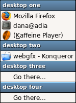</a>  

The combined client list menu

We've added a new client list menu. Instead of having a submenu for each desktop, it combines all your desktops into one menu.  This menu is used by middle click on the desktop in the default configuration.

To show this menu, put the following into a keyboard or mouse binding:

<code><pre>&lt;action name=&quot;ShowMenu&quot;&gt;&lt;menu&gt;client-list-combined-menu&lt;/menu&gt;&lt;/action&gt;</pre></code>

For example, from the default configuration:

<code><pre>
&lt;mousebind button=&quot;Middle&quot; action=&quot;Press&quot;&gt;
  &lt;action name=&quot;ShowMenu&quot;&gt;&lt;menu&gt;client-list-combined-menu&lt;/menu&gt;&lt;/action&gt;
&lt;/mousebind&gt;
</pre></code>
<h3>  Iconified windows in the client list menus </h3>

Iconified windows in the client list menus used to be shown below a separator. In Openbox 3.4 we have gotten rid of the visual clutter created by that separator.

Instead, iconified windows will always appear at the bottom of the list and will be surround with brackets. You can see, for example, that Kaffeine Player is iconified in the picture of the <a href="#Combined_client_list_menu"> combined client list menu</a>.

<h3>  Keyboard accelerators (using letters instead of arrows) </h3>

Wouldn't it be nice if you could just hit a letter to instantly choose the item you wanted in your menus? Now you can!

In the <a href="#New_client_menu"> new client menu</a>, the shortcuts are highlighted with an underline.  In other menus, underlines are not used, instead you can just press the first letter of a menu item to jump to it.  If there are multiple entries with the same letter, press it again to go to the second one.

If the first letter of a menu entry is not an ASCII alpha-numeric character, then the first such character will be used as the shortcut for that entry, and it will be underlined.

Now you can navigate your menus at light speed.

<h3>  No more menu titles </h3>

We've had a large number of requests from users who wanted to get rid of the titles at the top of their menus.  So instead of just letting you turn them on and off, we decided to give you a whole range of flexibility.

Menus no longer have titles. So if you don't want a title, you don't need one. But in their place you can now put headers (which look like the old titles) anywhere you want in your menu.  In the picture of the <a href="#Combined_client_list_menu"> combined client list menu</a> above, there is a header for each desktop.  You can do the same to separate sections of your own menus.

The default menu that comes with Openbox puts a header at the top of the menu, so it looks like the old menu title used to. Just remove the separator item from the menu and it will no longer have a title.

You put these headers in your menu by using separators, but with a label attribute, such as:

<code><pre>
&lt;menu id=&quot;root-menu&quot; label=&quot;Openbox 3&quot;&gt;
  &lt;separator label=&quot;Openbox&quot; /&gt;
&lt;/menu&gt;
</pre></code>
<h3>  Startup notification </h3>

  

Startup notification at work. Kicker is showing that Ktorrent is starting up.

Now when you run things from Openbox menus, you can enable startup notification.  This means that if you have a tasklist or some other program that visually displays when applications are starting, it can work from Openbox menus too.

It is, however, disabled by default because it shouldn't be used with just anything. If you use it with an older terminal program, anything you launch from the terminal will be given an old timestamp.  One way to fix that is to run <code>unset DESKTOP_STARTUP_ID</code> in your shell startup.  You also should not use it for commands that don't create a window on screen, because without a window being created, nothing will know when the command finished running.

To make use startup notification when launching a program use something like the following in your menu:

<code><pre>
&lt;item label=&quot;Calculator&quot;&gt;
  &lt;action name=&quot;Execute&quot;&gt;
    &lt;startupnotify&gt;
      &lt;enabled&gt;yes&lt;/enabled&gt;
      &lt;name&gt;Calculator&lt;/name&gt;
      &lt;icon&gt;gnome-calc2&lt;/icon&gt;
    &lt;/startupnotify&gt;
    &lt;execute&gt;gnome-calculator&lt;/execute&gt;
  &lt;/action&gt;
&lt;/item&gt;
</pre></code>

If you don't specify a <code>&lt;name&gt;</code> or <code>&lt;icon&gt;</code> field, they are derived from the command that is being executed.

If the application starts, and the notification doesn't go away, that means you shouldn't use it for that application. Any GNOME or KDE application will support startup notification by default.

You can also use this startup notification when launching applications with key bindings, in the same way.

The new startup notification feature is also mentioned in the <a href="#Improved_startup_notification"> usability section</a>.

<h3>  New client menu </h3>

<a href="images/NewClientMenu.png" class="image">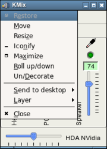</a>  

The new client menu

The client menu is the menu you get when you right click on an application's title bar or click its icon (in the default configuration).

The client menu has been restructured, revamped, and improved for Openbox 3.4. You can see in the picture to the right, the new structure of the menu. It's cleaner and easier to get to the item you want.

In addition, you can now use <a href="#Keyboard_accelerators_.28using_letters_instead_of_arrows.29"> keyboard accelerators</a> to navigate the menu.

As well, when you use a keyboard shortcut (Alt-space in the default configuration) to bring up the menu, it will now pop up at the top left corner of the window, rather than wherever your mouse pointer happens to be at the time.  You can see that happening in the picture also.

We've tried our best to make meaningful, unique keyboard shortcuts for all the current translations of Openbox also, but any improvements would be appreciated.

<h3>  Selecting disabled menu items </h3>

Disabled menu entries in the client menu can now be selected with the mouse or the keyboard. Visually, this is a lot nicer feeling, when you move the mouse around and the selected entry doesn't just disappear.

This also has the added bonus that no matter what entries in the menu are enabled or disabled, the same number of arrow keys or letter keys will always take you to the same entry.  Yay for consistent behavior.

<h3>  Menu placement </h3>

When you opened a menu close to the edge of the screen, opening sub-menus used to push the whole menu back from the edge of the screen, which could be jarring and make navigation difficult.

In Openbox 3.4, menus are always placed on screen such that they won't have to move afterward.  Sub-menus are opened cleverly to the side with room available, so that the menus behave in a more predictable manner.

<h3>  Large menus </h3>

<a href="images/NewMoreMenu.png" class="image">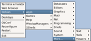</a>  

The new "More..." sub-menu

Menus that are bigger than your screen is tall are no longer a problem for Openbox.  When a menu grows too large, it will be split off into a sub-menu at the bottom titled "More...". You can see an example in the figure to the right.

<h2>  Themes </h2>
<h3>  New default theme </h3>

<a href="images/NewClearlooksTheme.png" class="image">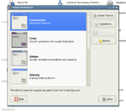</a>  

The new Clearlooks default theme, with the GTK theme by the same name

The Clearlooks and Clearlooks-Olive themes by John McKnight have been added to the Openbox distribution.  These themes were designed to go well with the Clearlooks GTK theme (and Klearlooks KDE theme).  Clearlooks has been made the default theme for Openbox 3.4.

<h3>  User specified fonts </h3>

Fonts are no longer loaded based on the theme.  You specify your fonts through the configuration file instead. However, font shadows are still read from the theme, from the font string, the same way as before.  For new themes you can just include the shadow information in the font line, such as:

<code><pre>window.active.label.text.font: shadow=y:shadowtint=70:shadowoffset=1</pre></code>

The default configuration has fonts set up in it, which you can modify.  If you'd like to use your old configuration, the new version of <a href="{{site.baseurl}}/obconf" title="ObConf:About"> ObConf</a> can set these for you or you can edit your configuration file by hand.

There are 5 different fonts used by Openbox: ActiveWindow, InactiveWindow, MenuHeader (for <a href="#No_more_menu_titles"> the new menu headers</a>), MenuItem, and OnScreenDisplay (for the various dialogs Openbox displays such as window cycling).

An example to set a font is:

<code><pre>
  &lt;font place=&quot;ActiveWindow&quot;&gt;
    &lt;name&gt;sans&lt;/name&gt;
    &lt;size&gt;8&lt;/size&gt;
    &lt;weight&gt;bold&lt;/weight&gt;
    &lt;slant&gt;normal&lt;/slant&gt;
  &lt;/font&gt;
</pre></code>

You need one section like this for each of the above listed fonts, with the <code>place</code> field changed appropriately.  See the <a href="#New_fonts"> configuration section</a> for the details of these configuration options.

<h3>  Distributed themes renamed </h3>

The themes distributed with Openbox have been renamed to begin with a capital letter. For example, the "syscrash" was renamed to "Syscrash" and the "bear2" theme was renamed to "Bear2".  If you use one of the default themes and your configuration is not finding it after upgrading, this would be why.  This change makes the themes more consistant with other themes both in the Openbox world and without.

<h3>  New tricks for "ParentRelative" textures </h3>

  

A parentrelative button, but with a bevel

In previous versions of Openbox, parentrelative textures could not add any decorations of their own, they had to only show through what was below them.

In Openbox 3.4 you can give parentrelative textures a border, bevel or interlacing, just like any gradient or solid texture.

<h3>  New theme elements for on-screen-displays </h3>

On-screen-displays such as the focus cycling (Alt-Tab) dialog, the coordinates dialog, or the key chains dialog, can now be themed independently.  Previously, they just used the window title styles, however, now you can set them however you wish.  (They fall back to using the window title styles as before.)

The new theme elements for on-screen-displays are:

<ul><li> osd.border.width - The border width given to dialogs
</li><li> osd.border.color - The color of the border around dialogs
</li><li> osd.bg - The background for dialogs
</li><li> osd.label.bg - The background for text in dialogs
</li><li> osd.label.text.color - The text color for dialogs
</li><li> osd.label.text.font - The text shadow for dialogs
</li><li> osd.hilight.bg - The texture for the selected desktop in the desktop cycling dialog
</li><li> osd.unhilight.bg - The texture for non-selected desktops in the desktop cycling dialog
</li></ul>

These are also all listed in the <a href="Themes" title="Help:Themes">theme specification</a>.

<h3>  New theme elements for toggled buttons </h3>

The toggled button theme elements have been split up into 3 elements for each, so that each toggled state can be themed independently.  You can still use the old elements, and things will work the same as they did previously, but you now have the option to theme toggled buttons with much more attention to detail.

<ul><li> window.active.button.toggled.image.color has been split into:
<ul><li> window.active.button.toggled.unpressed.image.color
</li><li> window.active.button.toggled.pressed.image.color
</li><li> window.active.button.toggled.hover.image.color
</li></ul>
</li><li> window.inactive.button.toggled.image.color has been split into:
<ul><li> window.inactive.button.toggled.unpressed.image.color
</li><li> window.inactive.button.toggled.pressed.image.color
</li><li> window.inactive.button.toggled.hover.image.color
</li></ul>
</li><li> window.active.button.toggled.bg has been split into:
<ul><li> window.active.button.toggled.unpressed.bg
</li><li> window.active.button.toggled.pressed.bg
</li><li> window.active.button.toggled.hover.bg
</li></ul>
</li><li> window.inactive.button.toggled.bg has been split into:
<ul><li> window.inactive.button.toggled.unpressed.bg
</li><li> window.inactive.button.toggled.pressed.bg
</li><li> window.inactive.button.toggled.hover.bg
</li></ul>
</li></ul>

The Onyx themes, added to the distribution in Openbox 3.4.1 demonstrate the uses of these new theme elements.

<h3>  menu.border.color </h3>

The <code>menu.border.color</code> property has been added to the theme format.  This allows you to set the border color for Openbox menus independently from that used for windows.

border.color has been obsoleted in 3.4, but is still used as a fallback if the new border colors are not specified.

<h3>  window.active.border.color </h3>

The <code>window.active.border.color</code> property has been added to the theme format.  This allows you to set the border color for the active (currently focused) window.  This color can be set independently for the active and inactive windows now. See <a href="#window.inactive.border.color"> window.inactive.border.color</a>.

Note that setting colors through globs such as window.active.*.color may set this property for you when you didn't mean to.  Themes which use globbing like this may display differently in Openbox 3.4 than previous versions.

border.color has been obsoleted in 3.4, but is still used as a fallback if the new border colors are not specified.

<h3>  window.active.title.separator.color </h3>

<a href="images/NewTitleSeparatorColors.png" class="image">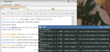</a>  

Using the new title separator colors

The <code>window.active.title.separator.color</code> property has been added to the theme format.  This allows you to set the color for the titlebar border (but only the section between the titlebar and the client) independently from the rest of the borders.  You can set this for both active an inactive windows.  See <a href="#window.inactive.title.separator.color"> window.inactive.title.separator.color</a>.

Note that setting colors through globs such as window.active.*.color may set this property for you when you didn't mean to.  Themes which use globbing like this may display differently in Openbox 3.4 than previous versions.

<h3>  window.inactive.border.color </h3>

The <code>window.inactive.border.color</code> property has been added to the theme format.  This allows you to set the border color for all inactive (not currently focused) windows.  This color can be set independently for the active and inactive windows now. See <a href="#window.active.border.color"> window.active.border.color</a>.

Note that setting colors through globs such as window.inactive.*.color may set this property for you when you didn't mean to.  Themes which use globbing like this may display differently in Openbox 3.4 than previous versions.

border.color has been obsoleted in 3.4, but is still used as a fallback if the new border colors are not specified.

<h3>  window.inactive.title.separator.color </h3>

  

Using the new title separator colors

The <code>window.inactive.title.separator.color</code> property has been added to the theme format.  This allows you to set the color for the titlebar border (but only the section between the titlebar and the client) independently from the rest of the borders.  You can set this for both active an inactive windows.  See <a href="#window.active.title.separator.color"> window.active.title.separator.color</a>.

Note that setting colors through globs such as window.inactive.*.color may set this property for you when you didn't mean to.  Themes which use globbing like this may display differently in Openbox 3.4 than previous versions.

<h3>  menu.border.width </h3>

The <code>menu.border.width</code> property has been added to the theme format.  This allows you to set the border width used for Openbox menus independantly from the border width used for windows.

<h3>  menu.items.active.disabled.text.color </h3>

<a href="images/ActiveDisabledMenuEntry.png" class="image">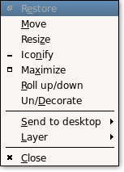</a>  

A highlighted, but disabled, menu entry

The <code>menu.items.active.disabled.text.color</code> property has been added to the theme format.  As of Openbox 3.4, disabled menu entries can still be hilighted by the mouse or keyboard.  This property lets you set the color of the text for disabled entries when they are hilighted.  Many themes disabled text and selected colors are quite similar, so this can be used to make the entries more readable.  See the image on the right for an example of a hilighted, but disabled, menu entry.

<h3>  Even sized titlebar buttons </h3>

Previously titlebar buttons would be an arbitrary size based on the font size you were using in the titlebar.  In Openbox 3.4 the titlebar button size has been standardized such that they will always be an even size.  This way, if you make even sized images for the buttons, you can know that it will always be centered.

<h3>  New default titlebar button images </h3>

<a href="images/NewDefaultTitlebarButtons.png" class="image">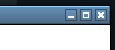</a>  

New default button images

The default images for the titlebar have been changed.  They are probably familiar since they appeared in many themes.  Now they will be used for any theme that doesn't provide its own images.

If you'd like to modify these images for your own themes, xbm copies of the images are installed to <code>/usr/share/doc/openbox/xbm/</code>.

<h3>  Improvements in the distributed themes </h3>

The distributed themes have been fixed up to work with all the latest features, such as the <a href="#menu.items.active.disabled.text.color"> menu.items.active.disabled.text.color</a>, and the change in the border colors.  None of them really take advantage of these new features yet though, that's where you themers come in.

<h2>  Configuration </h2>

The following talks about changes to the Openbox configuration file.  This file is found in <code>~/.config/openbox/rc.xml</code> for users, and the system-wide defaults are installed to <code>/etc/xdg/openbox/rc.xml</code>.

<h3>  New contexts </h3>

There are five new contexts for mouse bindings, and if you don't include them in your configuration file, they will not be used for anything.

The new contexts are: Left, Right, TLCorner, TRCorner, and Top. These refer to the edges of windows, and the default configuration uses them for resizing the window. Theese contexts can be used in the &lt;mouse&gt; section of your configuration file.  Here's what the default configuration has:

<code><pre>
&lt;mouse&gt;
  ...

  &lt;context name=&quot;Left&quot;&gt;
    &lt;mousebind button=&quot;Left&quot; action=&quot;Press&quot;&gt;
      &lt;action name=&quot;Activate&quot;/&gt;
    &lt;/mousebind&gt;
    &lt;mousebind button=&quot;Left&quot; action=&quot;Drag&quot;&gt;
      &lt;action name=&quot;Resize&quot;&gt;&lt;edge&gt;left&lt;/edge&gt;&lt;/action&gt;
    &lt;/mousebind&gt;
  &lt;/context&gt;

  &lt;context name=&quot;Right&quot;&gt;
    &lt;mousebind button=&quot;Left&quot; action=&quot;Press&quot;&gt;
      &lt;action name=&quot;Activate&quot;/&gt;
    &lt;/mousebind&gt;
    &lt;mousebind button=&quot;Left&quot; action=&quot;Drag&quot;&gt;
      &lt;action name=&quot;Resize&quot;&gt;&lt;edge&gt;right&lt;/edge&gt;&lt;/action&gt;
    &lt;/mousebind&gt;
  &lt;/context&gt;

  &lt;context name=&quot;TLCorner&quot;&gt;
    &lt;mousebind button=&quot;Left&quot; action=&quot;Press&quot;&gt;
      &lt;action name=&quot;Activate&quot;/&gt;
    &lt;/mousebind&gt;
    &lt;mousebind button=&quot;Left&quot; action=&quot;Drag&quot;&gt;
      &lt;action name=&quot;Resize&quot;/&gt;
    &lt;/mousebind&gt;
  &lt;/context&gt;

  &lt;context name=&quot;TRCorner&quot;&gt;
    &lt;mousebind button=&quot;Left&quot; action=&quot;Press&quot;&gt;
      &lt;action name=&quot;Activate&quot;/&gt;
    &lt;/mousebind&gt;
    &lt;mousebind button=&quot;Left&quot; action=&quot;Drag&quot;&gt;
      &lt;action name=&quot;Resize&quot;/&gt;
    &lt;/mousebind&gt;
  &lt;/context&gt;

  &lt;context name=&quot;Top&quot;&gt;
    &lt;mousebind button=&quot;Left&quot; action=&quot;Press&quot;&gt;
      &lt;action name=&quot;Activate&quot;/&gt;
    &lt;/mousebind&gt;
    &lt;mousebind button=&quot;Left&quot; action=&quot;Drag&quot;&gt;
      &lt;action name=&quot;Resize&quot;&gt;&lt;edge&gt;top&lt;/edge&gt;&lt;/action&gt;
    &lt;/mousebind&gt;
  &lt;/context&gt;

  ...
&lt;/mouse&gt;
</pre></code>

A new Bottom context has also been added, but in 3.4 it is just a synonym for the Handle context.  In future versions, the Handle context will be completely replaced by the new Bottom context.

How these new contexts can be used and what they can do for you is talked about more in the <a href="#Resizing_on_the_window.27s_edges"> usability section</a>.

<h3>  New fonts </h3>

Fonts are now specified from your configuration file instead of by your themes.  The default configuration has fonts set up in it that you can modify.

There are 5 different fonts used throughout Openbox: ActiveWindow, InactiveWindow, MenuHeader, MenuItem, and OnScreenDisplay.

ActiveWindow and InactiveWindow are used for window titlebars.  MenuHeader is used for the new <a href="#No_more_menu_titles"> menu headers</a>. MenuItem is used for the items in all Openbox menus.  OnScreenDisplay is used for popup dialogs such as the window cycling dialog shown by the Alt-Tab keys in the default configuration.

The fonts are set in the &lt;theme&gt; section of your configuration file. The default configuration has the following:

<code><pre>
&lt;theme&gt;
 ...

  &lt;font place=&quot;ActiveWindow&quot;&gt;
    &lt;name&gt;sans&lt;/name&gt;
    &lt;size&gt;8&lt;/size&gt;
    &lt;!-- font size in points --&gt;
    &lt;weight&gt;bold&lt;/weight&gt;
    &lt;!-- 'bold' or 'normal' --&gt;
    &lt;slant&gt;normal&lt;/slant&gt;
    &lt;!-- 'italic' or 'normal' --&gt;
  &lt;/font&gt;
  &lt;font place=&quot;InactiveWindow&quot;&gt;
    &lt;name&gt;sans&lt;/name&gt;
    &lt;size&gt;8&lt;/size&gt;
    &lt;!-- font size in points --&gt;
    &lt;weight&gt;bold&lt;/weight&gt;
    &lt;!-- 'bold' or 'normal' --&gt;
    &lt;slant&gt;normal&lt;/slant&gt;
    &lt;!-- 'italic' or 'normal' --&gt;
  &lt;/font&gt;
  &lt;font place=&quot;MenuHeader&quot;&gt;
    &lt;name&gt;sans&lt;/name&gt;
    &lt;size&gt;9&lt;/size&gt;
    &lt;!-- font size in points --&gt;
    &lt;weight&gt;normal&lt;/weight&gt;
    &lt;!-- 'bold' or 'normal' --&gt;
    &lt;slant&gt;normal&lt;/slant&gt;
    &lt;!-- 'italic' or 'normal' --&gt;
  &lt;/font&gt;
  &lt;font place=&quot;MenuItem&quot;&gt;
    &lt;name&gt;sans&lt;/name&gt;
    &lt;size&gt;9&lt;/size&gt;
    &lt;!-- font size in points --&gt;
    &lt;weight&gt;normal&lt;/weight&gt;
    &lt;!-- 'bold' or 'normal' --&gt;
    &lt;slant&gt;normal&lt;/slant&gt;
    &lt;!-- 'italic' or 'normal' --&gt;
  &lt;/font&gt;
  &lt;font place=&quot;OnScreenDisplay&quot;&gt;
    &lt;name&gt;sans&lt;/name&gt;
    &lt;size&gt;9&lt;/size&gt;
    &lt;!-- font size in points --&gt;
    &lt;weight&gt;bold&lt;/weight&gt;
    &lt;!-- 'bold' or 'normal' --&gt;
    &lt;slant&gt;normal&lt;/slant&gt;
    &lt;!-- 'italic' or 'normal' --&gt;
  &lt;/font&gt;
&lt;/theme&gt;
</pre></code>

This new font selection is also mentioned in the <a href="#User_specified_fonts"> usability section</a>.

<h3>  NextWindow for all desktops </h3>

The NextWindow and PreviousWindow actions have had the &lt;allDesktops&gt; option added to them.  The &lt;allDesktops&gt; option is a boolean value (on/off/yes/no) which defaults to off.  When you enable it, the action will allow you to cycle through windows on all of your desktops.

Here is an example of using it:

<code><pre>
  &lt;keybind key=&quot;A-Tab&quot;&gt;
    &lt;action name=&quot;NextWindow&quot;&gt;&lt;allDesktops&gt;yes&lt;/allDesktops&gt;&lt;/action&gt;
  &lt;/keybind&gt;
  &lt;keybind key=&quot;A-S-Tab&quot;&gt;
    &lt;action name=&quot;PreviousWindow&quot;&gt;&lt;allDesktops&gt;yes&lt;/allDesktops&gt;&lt;/action&gt;
  &lt;/keybind&gt;
</pre></code>

The <a href="#Cycling_across_all_desktops"> usability section</a> talks more about this new feature and shows it in use.

<h3>  NextWindow and DirectionalFocus for panels and desktop windows </h3>

The NextWindow, PreviousWindow, DirectionalFocusNorth, DirectionalFocusSouth, DirectionalFocusEast, and DirectionalFocusWest actions have had added to them the &lt;panels&gt; and &lt;desktop&gt; options.  These take boolean values (on/off/yes/no) and they both default to off.

When &lt;panels&gt; is enabled, the action will allow you to move focus to any panel windows on screen.  When &lt;desktop&gt; is enabled, the action will allow you to move focus to your desktop window, if you have one.  The options can be combined to let you use one action to cycle through both, as is done in Metacity.  When either one is enabled, the action will no longer go to regular windows.

In the default configuration, Control-Alt-Tab is bound to NextWindow with both of these options enabled, which is similar to the default bindings in Metacity.  The default configuration has this:

<code><pre>
&lt;keyboard&gt;
  ...

  &lt;keybind key=&quot;C-A-Tab&quot;&gt;
    &lt;action name=&quot;NextWindow&quot;&gt;
      &lt;panels&gt;yes&lt;/panels&gt;&lt;desktop&gt;yes&lt;/desktop&gt;
    &lt;/action&gt;
  &lt;/keybind&gt;

  ...
&lt;/keyboard&gt;
</pre></code>

The <a href="#Focus_cycling_to_panels_and_desktop_windows"> usability section</a> talks about these new options.

<h3>  Chrooted key chains and BreakChroot action </h3>

A new attribute called "chroot" has been added to the &lt;keybind&gt; element. The chroot attribute is a boolean value (on/off/yes/no) which defaults off.  When it is enabled, the keybind is turned into a chroot.

Chrooting, what it means, and how to use it, is described in the <a href="#Chroot_key_chains_and_key_quoting"> usability section</a>.

Any keybind can be made a chroot, even if there are no key bindings chained within it.  In that case the global &lt;chainQuitKey&gt; (Control-G by default) will need to be used to exit the chroot.  Chroots can also be nested within other chroots for pretty much unlimited complexity if that's what you are after.

A new action BreakChroot has also been added which is only useful inside of a chrooted key binding.  This action breaks out of one level of chroot.  You can chain multiple BreakChroots together to break out of multiple levels of chroots if you are nesting them.

Here's an example of a chroot key binding:

<code><pre>
  &lt;keybind key=&quot;C-A-d&quot; chroot=&quot;true&quot;&gt;                                           
    &lt;keybind key=&quot;Up&quot;&gt;&lt;action name=&quot;DesktopUp&quot;&gt;&lt;dialog&gt;no&lt;/dialog&gt;&lt;/action&gt;&lt;/keybind&gt;                 
    &lt;keybind key=&quot;Down&quot;&gt;&lt;action name=&quot;DesktopDown&quot;&gt;&lt;dialog&gt;no&lt;/dialog&gt;&lt;/action&gt;&lt;/keybind&gt;                 
    &lt;keybind key=&quot;Left&quot;&gt;&lt;action name=&quot;DesktopLeft&quot;&gt;&lt;dialog&gt;no&lt;/dialog&gt;&lt;/action&gt;&lt;/keybind&gt;                 
    &lt;keybind key=&quot;Right&quot;&gt;&lt;action name=&quot;DesktopRight&quot;&gt;&lt;dialog&gt;no&lt;/dialog&gt;&lt;/action&gt;&lt;/keybind&gt;                 
    &lt;keybind key=&quot;Escape&quot;&gt;&lt;action name=&quot;BreakChroot&quot;/&gt;&lt;/keybind&gt;              
  &lt;/keybind&gt;
</pre></code>
<h3>  New Root context </h3>

Another new context, above the Top, Left, Right, and so on, has been added to Openbox 3.4.  We've added a "Root" context which serves as a context only for the root window.  This means the mouse bindings in the root context will only work if you're not using a desktop program for icons, such as in GNOME and KDE.  This allows us to put root menu bindings in the default configuration without overriding the menus provided by these desktop environments' desktops.  

This new context is talked about and its uses decribed in the <a href="#Root_context_for_mouse_bindings"> usability section</a>.

<h3>  Windows key in key bindings </h3>

Key bindings that use W as a modifier key have changed.  W used to be hard-coded to be Mod4Mask.  Now it has been changed to whatever mask you have the Super mod key bound to.

You can use <code>xmodmap</code> to see your current bindings. Most modern distributions bind the windows key to Super_L, and bind Super_L to Mod4Mask.  So this should probably not affect you unless you have a highly customized system, or have customized your xmodmap.

<h3>  hideDisabled removed </h3>

The &lt;hideDisabled&gt; option has been removed from the configuration file, in favour of <a href="#Auto-hiding_decorations"> auto-hiding decorations</a>.

<h3>  edges_hit_layers_below removed </h3>

The &lt;edges_hit_layers_below&gt; option has been removed from the configuration file, in an effort to simplify and clarify our configuration.

<h3>  Settings for specific windows (<a href="Applications" title="Help:Applications">Per-application settings</a>) </h3>
<h4>  Matching windows with wildcards </h4>

The per-application settings have been revamped for Openbox 3.4. When specifying the name, class, or role for a rule, you can use simple wildcard matching with the "*" and "?" characters. A "*" matches any number of characters and a "?" matches any single character.

This means that the role has changed how it is matched.  It used to just match the first 'n' characters, 'n' was the length of the string you provided.  Now to get the same result, just append a "*" to the end of the role.

<h4>  Matching against multiple rules </h4>

As well, multiple rules can be applied to the same window.  This lets you do more with less writing.  For instance you could write one rule to match against all windows and then later rules could further change things for more specific windows.  The rules are matched in the order they appear in your configuration file, so later rules will override previous rules if they both specify the same setting for a window.

<h4>  Per-monitor positioning changed </h4>

The &lt;head&gt; parameter for positioning windows has been renamed to &lt;monitor&gt;.

<h4>  The "default" value </h4>

You can now use "default" as the content for any option in a rule.  This is the same as the option not being present at all.

