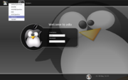
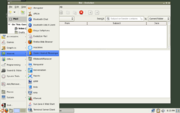
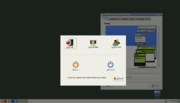

<h1 class="firstHeading">Help:Using Openbox in GNOME</h1>

<h3 id="siteSub">From Openbox</h3>

Jump to: <a href="#column-one">navigation</a>, <a href="#searchInput">search</a>

<table id="toc" class="toc"><tr><td>
<h2>Contents</h2>

<ul>
<li class="toclevel-1 tocsection-1"><a href="#Starting_Openbox_with_GNOME">1 Starting Openbox with GNOME</a></li>
<li class="toclevel-1 tocsection-2"><a href="#Accessing_gnome-panel_with_key_bindings">2 Accessing gnome-panel with key bindings</a></li>
<li class="toclevel-1 tocsection-3"><a href="#Logging_out">3 Logging out</a></li>
<li class="toclevel-1 tocsection-4"><a href="#Nautilus_and_Openbox">4 Nautilus and Openbox</a></li>
</ul>
</td></tr></table>
<h2>  Starting Openbox with GNOME </h2>

  

Figure 1: The GNOME/Openbox option when logging in

The instructions below don't work with current versions of GNOME and Openbox versions before 3.4.8.  As a workaround, you can run the command <code>openbox --replace</code> after logging into a standard GNOME session, and cross your fingers.

To log into the GNOME desktop environment with Openbox as your window manager, select the "GNOME/Openbox" 
option when logging in through GDM, which you can see in Figure 1.

If you don't use a graphical log in, you can use the <code>openbox-gnome-session</code> command to start a GNOME session with Openbox as your window manager.

See the <a href="Getting_started" title="Help:Getting started"> getting started guide</a> for more details.

<h2>  Accessing gnome-panel with key bindings </h2>

  

Figure 2: The gnome-panel main menu

If you are using gnome-panel in Openbox and want to access it with key bindings, you can use the <code>gnome-panel-control</code> program (which is a part of Openbox) to do so.

Here is an example of two bindings to pop up the gnome-panel's main menu, and to pop up the "Run" dialog:

<code><pre>
&lt;keybind key=&quot;A-F1&quot;&gt;
    &lt;action name=&quot;execute&quot;&gt;&lt;execute&gt;gnome-panel-control --main-menu&lt;/execute&gt;&lt;/action&gt;
&lt;/keybind&gt;
&lt;keybind key=&quot;A-F2&quot;&gt;
    &lt;action name=&quot;execute&quot;&gt;&lt;execute&gt;gnome-panel-control --run-dialog&lt;/execute&gt;&lt;/action&gt;
&lt;/keybind&gt;
</pre></code>

Just add that to the &lt;keyboard&gt; section of your <code>rc.xml</code> <a href="Configuration" title="Help:Configuration"> configuration file</a>, and change the keys to match your preferences. The keys shown are the defaults used by Metacity, the default window manager for GNOME.

<h2>  Logging out </h2>

  

Figure 3: The GNOME logout screen, shown with gnome-session-save

In order to log out of GNOME without going through the gnome-panel, you can use the command <code>gnome-session-save --kill --gui</code>.

Here is an example of a "Log out" option for a menu:

<code><pre>
&lt;menu id=&quot;root-menu&quot;&gt;
  ...
  &lt;item label=&quot;Log out&quot;&gt;
    &lt;action name=&quot;Execute&quot;&gt;&lt;execute&gt;gnome-session-save --kill --gui&lt;/execute&gt;&lt;/action&gt;
  &lt;/item&gt;
&lt;/menu&gt;
</pre></code>

You can also use the same command in a key binding to log out by pressing a key combination.

The session state may not be preserved when you log out with Openbox running.  You can fix this by restarting Metacity first, for example with the following shell script.

<code><pre>
killall openbox
coproc metacity
gnome-session-save --logout-dialog
</pre></code>

And to shut down

<code><pre>
killall openbox
coproc metacity
gnome-session-save --shutdown-dialog
</pre></code>
<h2>  Nautilus and Openbox </h2>

If you don't want Nautilus to draw icons on your desktop, you can disable it with the <code>gconf-editor</code> program.  Run <code>gconf-editor</code> and browse to "/apps/nautilus/preferences" and turn off the <b>show desktop</b> option. Another simpler way to get that is to call nautilus with the --no-desktop switch.

If you do want icons from Nautilus on your desktop, you should disable the menu Openbox shows when you right-click on the desktop.  Other desktop programs don't have this problem, but with Nautilus you won't be able to access its right-click menu unless you disable Openbox's (or use Shift-Right Click to access the Nautilus menu).  In the default configuration <code>rc.xml</code> file, remove the following section (in the "Root" mouse-binding context):

<code><pre>
    &lt;mousebind button=&quot;Right&quot; action=&quot;Press&quot;&gt;
      &lt;action name=&quot;ShowMenu&quot;&gt;&lt;menu&gt;root-menu&lt;/menu&gt;&lt;/action&gt;
    &lt;/mousebind&gt;
</pre></code>

Also, file a bug report for Nautilus so you won't have to do this in the future.

